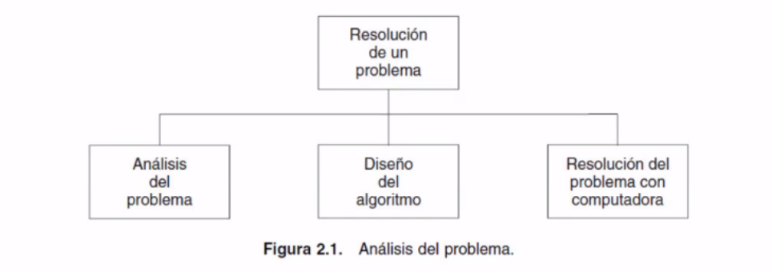
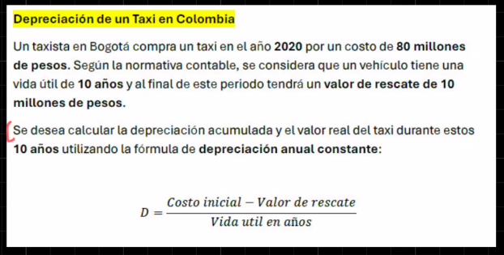

## Los 7 pasos de crear una aplicación.

Las faces de resolución de un problema con computadora son:

-   1. Análisis del problema.
-   2. Diseño del algoritmo.
-   3. Codificación.
-   4. Compilación y ejecución.
-   5. Verificacion
-   6. Depuración.
-   7. Mantenimento
-   8. La documentación.

## Análisis del problema
La fase de la resolución de un problema con computadora es el **analisis del problema**, Esta fase requiere una definicion clara donde se contemple lo que debe hacer el programa y el resultado o solución deseada. Se precisan especificaciones detalladas de entrada y salida, los siguinetes son los requisistos qu se debe definir en el analisis.

Para poder identificar y definir bien el problema es conveniete responder las siguientes preguntas:

-   ¿Qué entradas se requieren? (tipo de datos los cuales se trabajara y cantidad).
-   ¿Cuál es la salida deseada? (tipo de datos de los resultados y cantidad).
-   ¿Qué método produce la salida deseada?
-   Requisitos o requerimientos adicionales y restricciones a la solución.

Entrada        Salida

CI = 80        DA = Tabla con el año de depresiación acumulada del valor real del taxi
VR = 10        
VU = 10
AC = 2020

