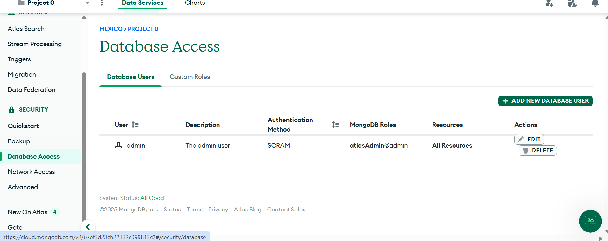
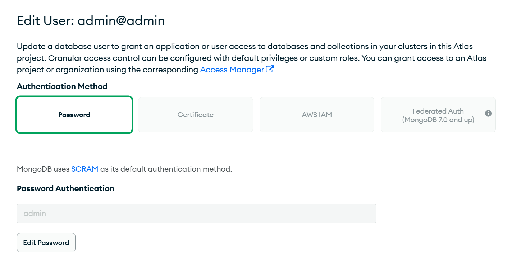
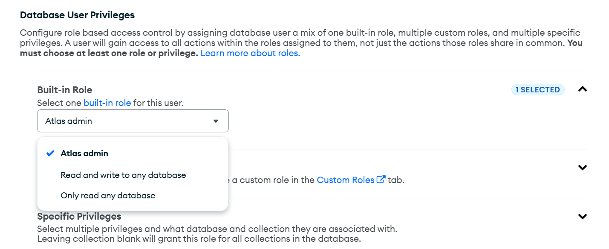
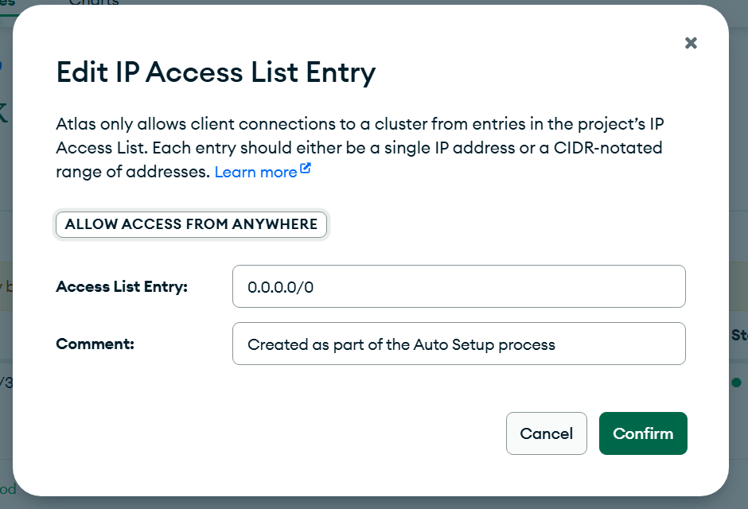
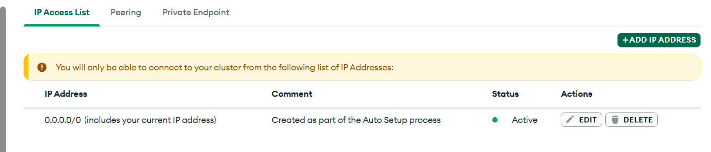

## SQL VS NoSQL
SQL     ->  Datos estructurados con relaciones bien establecidas entre ellos

NoSQL   ->  AMAZON      Rompe las estructuras de SQL
            Google      Trabaja con datos con Clave -> Valor (Similar a un diccionario)
                        Ejemplos: Reddi, Mongo, Dynamo
                        Se utiliza mucho en bigdata
                        
Mongo DB, se puede usar de manera local o Web (remoto)                        


Crear un usario en mongo DB dar click en +ADD NEW DATABASE USER:


Añadir el nombre del usuario y password


Dar permisos para poder crear, editar, borrar y leer, basicamete todos los permisos


Netword access to Mongo DB data base:

Para poder acceder desde cualquier punto de red la ip se debe configurar de la siguiente forma.
 

Y quedaria de la siguiente forma


Instalar la libreria para conectarnos con mongo db:
```
python -m pip install "pymongo[srv]"
```