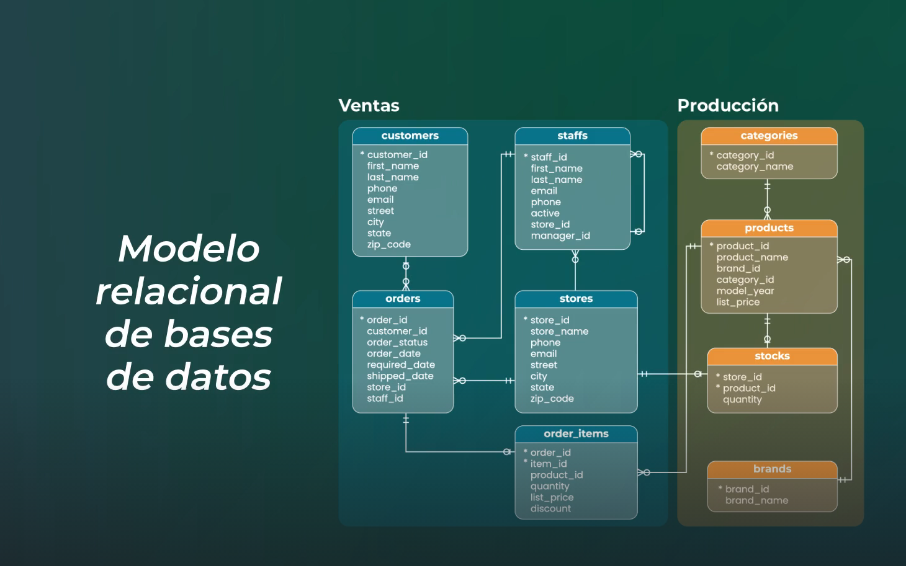
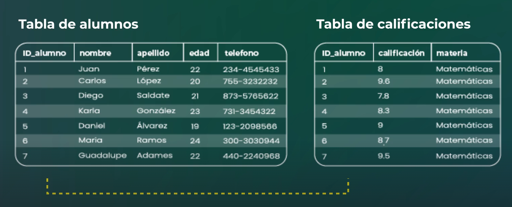
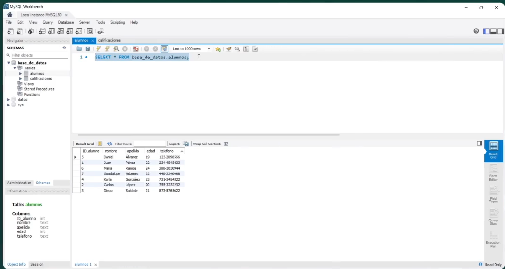
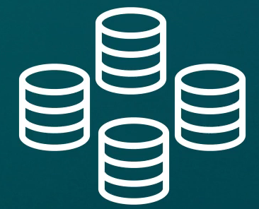
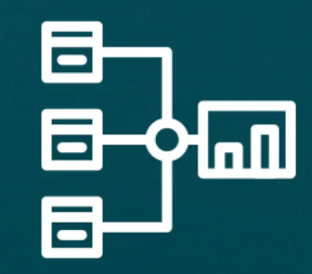
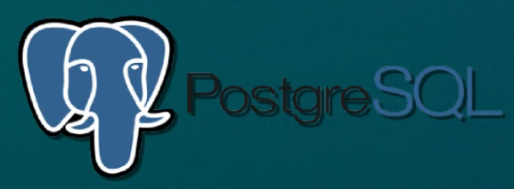
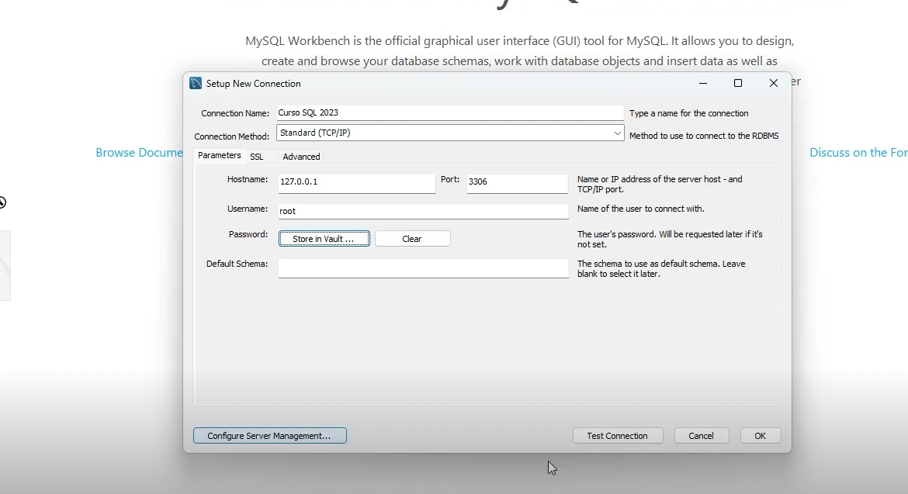

## SQL

Lenguaje de consultas estructurado (Structured Query Language). Para hablar con base de datos y accesar a su información. Su primera versión se llamo SQUELE. 

SQL depende del Modelo relacional de base de datos.


Donde los datos se organizan en varias tablas que se racionan entre si. Cada tabla tiene su propia clabe que se identifican entre si. 
Ejemplo en una tabla se puden tener los estudiantes de una escuela y en otra las calificaciones de esos alumnos donde la tabla calificacions contiene la relación con la tabla 
alumnos por medio del id_del alumno.



Los modelos relacionales hacen muy sencillo el cambio y consulta de la información.

En el lenguaje SQL comienzas con cláusulas -> Las cláusulas son condiciones de modificación utilizadas para definir los datos que se desean seleccionar o manipular.

Ejemplo seleccionar telefonos de la tabla alumnos:
```
SELECT telefono FROM alumnos;
```

En **SQL** se pueden hacer dos tipos de operaciones principales:

-   1. **Consultar información** (solo te dedicas a extraer datos).


-   2. Las **declaraciones**, podría llegar a alterar la base de datos o controlar transacciones.

No todas las declaraciones alteran tus datos.
Entre versiones de gestores de base de datos como mysql o posgres tienen minimas variaciones de sintáxis. 

S -> Structured (SEQUEL)
Q -> Query
L -> Language
Es en esencia un "lenguaje de programación" diseñado especialmente para consultar datos..., en una base de datos.

Ejemplo de SQL


Seleccionar los nombres de la base de datos niños.

```
SELECT nombres FROM * Niños;
```

No solo es la Base de datos, la tabla ens tiene el nombre de "niños" 

Seleccionar las calificaciones de los niños del grado 2.
```
SELECT FROM niños WHERE grado=2;
```

Hay empresas con los volúmes **ENÓRMES** de información. Solo con SQL, se puede acceder a esta informacion.


Conocimientos avanzados den SQL.

-   Consulta de datos.


-   Armar tus propias bases de datos.


- Crear pipelines para obtener los datos.


Esto te integra ya en ingeneieria de datos.

Algunos sabores/varidad de SQL:

-   MySQL:
    Una versión de Open Source, su popularidad ha ido en desenso desde 2014.
        

-   PostgresSQL:
    De crecimiento lento pero seguro, parace qu para finales de 202X sera el dominate.
    


Crear una conexión con MySQL con Workbench.



La conexión siempre se realiza por TCP/Ip
Donde:  
    -   Hostname: 127.0.0.1 es la ip de servido de la base de datos en el caso de ser local siempres es la ip 127.0.0.1 
    -   Port: 3306 es el puerto ddel servicio por donde nos conectamos a MySql

