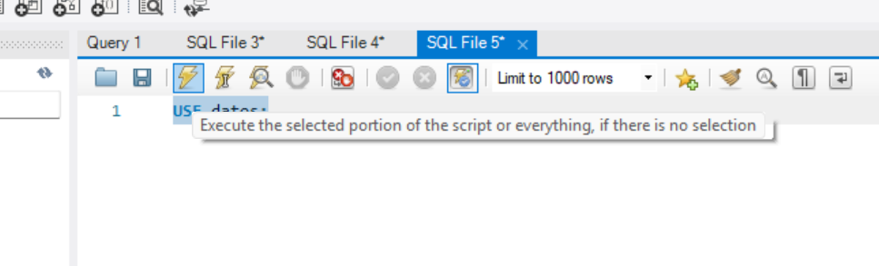
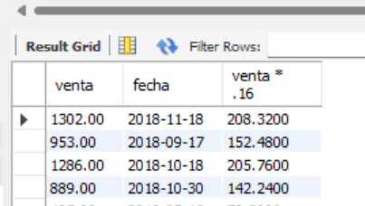

### Crear tabla Index y 3 tablas 
```
-- Create the Index database
CREATE DATABASE IF NOT EXISTS `Index`;
USE `Index`;

-- Create the Sales table (ventas_idx.csv)
CREATE TABLE IF NOT EXISTS `Ventas` (
  `Fecha` DATE,
  `ID_local` INT,
  `clave_producto` VARCHAR(3),
  `venta` INT,
  `venta_empleado` INT,
  PRIMARY KEY (`Fecha`, `ID_local`, `clave_producto`)
);

-- Create the Employees table (empleados_idx.csv)
CREATE TABLE IF NOT EXISTS `Empleados` (
  `ID_empleado` INT PRIMARY KEY,
  `Nombre` VARCHAR(50),
  `Apellido` VARCHAR(50),
  `Telefono` VARCHAR(20),
  `Edad` INT,
  `Domicilio` VARCHAR(100),
  `ID_Gerente` INT,
  FOREIGN KEY (`ID_Gerente`) REFERENCES `Empleados`(`ID_empleado`)
);

-- Create the Blog Posts table (blogger.csv)
CREATE TABLE IF NOT EXISTS `Blog` (
  `publicacion_id` INT PRIMARY KEY,
  `Titulo` VARCHAR(255),
  `Contenido` TEXT,
  `Fecha_posteo` DATE
);

-- Insert data into Ventas table
INSERT INTO `Ventas` (`Fecha`, `ID_local`, `clave_producto`, `venta`, `venta_empleado`) VALUES
('2020-02-08', 2, 'pzz', 1302, 2630867),
('2019-07-21', 2, 'clz', 953, 2310967),
('2019-04-06', 4, 'brr', 1286, 6931035),
('2019-03-17', 1, 'brr', 889, 9922377),
('2019-10-10', 1, 'qsd', 495, 2520477),
('2019-07-13', 3, 'pzz', 544, 9611338),
('2019-10-03', 4, 'pzz', 1444, 6332756),
('2020-01-01', 1, 'pzz', 435, 2520477),
('2019-04-22', 1, 'qsd', 1203, 9922377);

-- Primero insertamos el gerente (solución al error de clave foránea)
INSERT INTO `Empleados` (`ID_empleado`, `Nombre`, `Apellido`, `Telefono`, `Edad`, `Domicilio`, `ID_Gerente`) VALUES
(5942572, 'Jesus', 'Agudelo', '34616222', 35, NULL, NULL);

-- Luego insertamos el resto de empleados
INSERT INTO `Empleados` (`ID_empleado`, `Nombre`, `Apellido`, `Telefono`, `Edad`, `Domicilio`, `ID_Gerente`) VALUES
(1111222, 'Alberto', 'Barrientos', '34766613', 26, 'Federal 233', 5942572),
(9922377, 'Alexander', 'Martinez', '36554872', 28, 'Camino viejo 123', 5942572),
(3833745, 'Maria', 'Zapata', '35354455', 34, 'Boulevard 85', 5942572),
(2520477, 'Egidio', 'Lopez', '33444383', 24, 'Rosas 996', 5942572),
(9611338, 'Haygnes', 'Ortiz', '35400189', 27, 'General Diaz 343', 5942572),
(4245367, 'Alexandra', 'Zapata', '33467136', 31, 'Ingenieros 234', 5942572),
(2630867, 'Elena', 'Atehortua', '35581732', 37, 'Sierra del tigre 299', 5942572),
(2310967, 'Jairo', 'Mira', '36403810', 29, 'Calle 25 interior 2', 5942572),
(6931035, 'Albeiro', 'Villa', '33631010', 39, 'Carniceros 233', 5942572),
(6332756, 'Reinaldo', 'Gonzalez', '36642727', 43, 'Vallarta 711', 5942572);

-- Insert data into Blog table
INSERT INTO `Blog` (`publicacion_id`, `Titulo`, `Contenido`, `Fecha_posteo`) VALUES
(1, 'Tipo de dato informatico', 'Un tipo de dato es, un espacio en memorias con restricciones. Por ejemplo, el tipo "int" representa, generalmente, un conjunto de enteros de 32 bits cuyo rango va desde el -2.147.483.648 al 2.147.483.647, asн como las operaciones que se pueden realizar con los enteros, como son la suma, la resta, y la multiplicaciуn. Los colores, por su parte, se representan como tres bytes denotando la cantidad de rojo, verde y azul, y una cadena de caracteres representando el nombre del color (en este caso, las operaciones permitidas incluyen la adiciуn y la sustracciуn, pero no la multiplicaciуn).\nEste es un concepto propio de la informбtica, y mбs especнficamente de los lenguajes de programaciуn, aunque tambiйn se encuentra relacionado con nociones similares de la matemбtica y la lуgica.El tipo de dato lуgico o booleano es en computaciуn aquel que puede representar valores de lуgica binaria, esto es 2 valores, que normalmente representan falso o verdadero.? Se utiliza normalmente en la programaciуn, estadнstica, electrуnica, matemбticas,', '2019-11-19'),

(2, 'Lenguaje PHP', 'PHP es un lenguaje de programaciуn de uso general que se adapta especialmente al desarrollo web.2? Fue creado inicialmente por el programador danйs-canadiense Rasmus Lerdorf en 1994.3? En la actualidad, la implementaciуn de referencia de PHP es producida por The PHP Group.4? PHP originalmente significaba Personal Home Page (Pбgina personal), pero ahora significa el inicialismon 1? recursivo PHP: Hypertext Preprocessor.6?\n\nEl cуdigo PHP suele ser procesado en un servidor web por un intйrprete PHP implementado como un mуdulo, un daemon o como un ejecutable de interfaz de entrada comъn (CGI). En un servidor web, el resultado del cуdigo PHP interpretado y ejecutado —que puede ser cualquier tipo de datos, como el HTML generado o datos de imбgenes binarias— formarнa la totalidad o parte de una respuesta HTTP. Existen diversos sistemas de plantillas, sistemas de gestiуn de contenidos y frameworks que pueden emplearse para organizar o facilitar la generaciуn de esa respuesta. Por otra parte, PHP puede utilizarse para muchas tareas de programaciуn fuera del contexto de la web, como aplicaciones grбficas autуnomas7? y el control de drones.8? Tambiйn se puede interpretar y ejecutar un cуdigo PHP cualquiera a travйs de una interfaz de lнnea de comandos (CLI).', '2019-06-13'),

(3, 'Programacion Basica', 'Los tipos de datos en un lenguaje de programaciуn pueden ser muy variados, asн que es difнcil preguntarte cuantos tipos de datos hay en un lenguaje, ya que incluso puedes crearte los tuyos propios, mediante enumeraciones o estructuras. Ponemos tres ejemplos de tipos de datos bбsicos que son los mбs utilizados: los nъmeros, los textos y las fechas. Si estamos con textos, podemos comparar (si son iguales o no), podemos sustituir parte del texto, aсadir texto a uno existente, etc. Cada lenguaje de programaciуn puede trabajar con muchos tipos de datos.\n\nPero de todos ellos, siempre tendremos los tipos primitivos de datos.\n\nЙstos estбn incorporados al lenguaje de programaciуn, y nos sirve para poder hacer cosas mбs complicadas.\n\nVamos a hablar de los tipos de datos mбs comunes, que te puedes encontrar en la mayorнa de los lenguajes de programaciуn, como puede ser Java, C o C++.', '2019-09-08'),

(4, 'Informatica y booleano', 'Los tipos de datos hacen referencia al tipo de informaciуn que se trabaja, donde la unidad mнnima de almacenamiento es el dato, tambiйn se puede considerar como el rango de valores que puede tomar una variable durante la ejecuciуn del programa. El tipo de dato carбcter es un dнgito individual el cual se puede representar como numйricos (0 al 9), letras (a-z) y sнmbolos (!""$&/\\). Booleanos es un tipo de dato que se emplea para valores lуgicos, los podemos definir como datos comparativos dicha comparaciуn devuelve resultados lуgicos (Verdadero o Falso). Booleano, String, Integer.', '2019-12-06'),

(5, 'Variables y tipos de datos', 'Todo programa de ordenador persigue ofrecer una funcionalidad determinada para la que, por regla general, necesitarб almacenar y manipular informaciуn. Dicha informaciуn, que son los datos sobre los que operaremos, deben almacenarse temporalmente en la memoria del ordenador. Para poder almacenar y recuperar fбcilmente informaciуn en la memoria de un ordenador los lenguajes de programaciуn ofrecen el concepto de variables, que no son mбs que nombres que "apuntan" a una determinada parte de la memoria y que el lenguaje utiliza para escribir y leer en esta de manera controlada.', '2019-08-19');
```


### ¿Porqué SQL no es un lenguaje de programación completo?
Porque le fatan muchos complementos que si tiene un lenguaje de programación completo.

### Cláusulas
Condiciones para definir los datos que deseas manipular o seleccionar.

### USE
-   Esta cláusula le dice a MySQL que la base de datos o esquema utilizar para consulta que estará a continuación.
```
USE periodos;
```
Para ejecutarla control + enter

ó
 
Dar click en el rayito 


Si deseo seleccionar la db datos de nuevo sería así:
```
USE datos;
```

El punto y coma (;) indica el final de una consulta o clausula dada.

### SELECT 
Cláusula que permite seleccionar información (columnas de una tabla) y manipularla.

Las consultas depende de dos cosas en particular:
-   Lo que quiero 
-   De donde va a venir

En SELECT indicamos que columnas quiero y de que tabla lo quiero, si coloco * es todas las columnas de la tabla.

```
SELECT * from empleados;
```
- Selecciono todas las columas de empleados.

### FROM 
Utilizada para enlistar las tablas requeridas o uniones requeridas para ejecutar consultas.


Seleccionar todas las columnas de la tabla ventas
```
SELECT * from ventas;
```
Seleccionar todos los productos:
```
SELECT * FROM productos;
```

Seleccionar la columna venta de la tabla ventas;

```
SELECT tabla FROM ventas;
```

Selecionar mas de una columna, la columna venta, fecha de la tabla ventas:
```
SELECT venta, fecha FROM ventas;
```

Nombres a retornos de consultas

-   Si tengo ventas y deseo devolver el iva de la venta, mas la venta y la fecha esto me daria una consulta de esta forma:
```
SELECT venta, fecha, venta * .16 FROM ventas;
```
Pero el nombre de la columna retornada para el iva de la venta esta raro.


Por lo que lo ideal es usar AS para personalizar el nombre de una columna o retorno, en este caso renombramos venta * .16 AS IVA.

```
SELECT venta, fecha, .16*venta AS iva_cobrado FROM ventas;
```
### AS (como):
Utilizada para renombrar una columna o tabla con un alias. El alias solo existirá durante la consulta, es decir no modifica la tabla original.

### WHERE:
Utilizada para filtrar los registros de la tabla seleccionada, extrae los datos que cumple con cierta condición (un filtro).

Traer la tabla ventas donde el local es 2
```
SELECT * 
FROM ventas WHERE ID_LOCAL = 2; 
```

Seleccionar de la fecha y venta de la tabla ventas donde el local es el 2:
```
SELECT fecha, venta
FROM ventas WHERE ID_LOCAL = 2;
```

#### Operadores de comparación sql.

Se usan para comparar dos valores y devolver un resultado booleano (verdadero o falso), lo cual es muy útil en condiciones donde WHERE,  IF y expreciones lógicas. 

| Operador         | Significado                  | Ejemplo                          |
|------------------|------------------------------|----------------------------------|
| =                | Igual                        | `edad = 25`                      |
| <>               | Distinto (también `!=`)      | `nombre <> 'Juan'`              |
| !=               | Distinto                     | `precio != 100`                 |
| >                | Mayor que                    | `calificacion > 8`              |
| <                | Menor que                    | `stock < 50`                    |
| >=               | Mayor o igual que            | `sueldo >= 10000`               |
| <=               | Menor o igual que            | `nota <= 7`                     |
| BETWEEN ... AND  | Entre un rango               | `edad BETWEEN 18 AND 30`        |
| IN (...)         | Dentro de una lista          | `pais IN ('México', 'Chile')`   |
| NOT IN (...)     | No está en la lista          | `color NOT IN ('Rojo', 'Azul')` |
| LIKE             | Coincidencia con comodines   | `nombre LIKE 'A%'`              |
| IS NULL          | Es nulo                      | `email IS NULL`                 |
| IS NOT NULL      | No es nulo                   | `telefono IS NOT NULL`          |

Seleccionar ventas en ventas con un valor menor a 1000:
```
SELECT *
FROM ventas WHERE venta < 1000;
```

Seleccionar ventas en ventas con un valor menor O IGUAL a 1000:

```
SELECT *
FROM ventas WHERE venta <= 1000;
```

Seleccionar todas las ventas de todos los locales excepto el 2:

```
SELECT *
FROM ventas WHERE ID_LOCAL <> 2;
```

o


```
SELECT *
FROM ventas WHERE ID_LOCAL != 2;
```

Seleccionar elementos con un aleas, los elementos no que no existen por el momento en la tabla y se consultan con WHERE dan error.

Esto daria error por que IVA es un aleas y no existe en la tabla, por el momento.
```
SELECT *, venta*.16 AS IVA
FROM ventas 
WHERE IVA < 150;
```

### AND, OR, NOT
- Si queremos realizar un SELECT DONDE se cumplan mas de una condicion un WERE sencillo no podra cumplir con esto.

#### AND
- Datos que cumplan con dos o mas condiciones.

### OR
- Datos que cumplan con cualquiera de las condiciones.

Seleccionar todas la ventas donde el local sea 2 y pizza:
```
SELECT *
FROM ventas WHERE ID_LOCAL = 2 AND CLAVE_PRODUCTO = 'pzz';
```

Todas la ventas del local 2 o de pizza:
```
SELECT *
FROM ventas WHERE ID_LOCAL = 2 OR CLAVE_PRODUCTO = 'pzz';
```

Seleccionar todas las ventas del local 4 y del local 2:
```
SELECT *
FROM ventas WHERE ID_LOCAL = 2 OR  ID_LOCAL = 4; 
```

Seleccionar las ventas que no son de pizza:
```
SELECT *
FROM ventas WHERE NOT CLAVE_PRODUCTO='pzz';
```

Seleccioanr las ventas del local 2 que no fueron de pizza:
```
SELECT *
FROM ventas WHERE NOT CLAVE_PRODUCTO='pzz' AND ID_LOCAL = 2;
```

Seleccioanr las ventas QUE NO SON del local 2 que no fueron de pizza:
```
SELECT *
FROM ventas WHERE NOT CLAVE_PRODUCTO='pzz' AND NOT ID_LOCAL = 2;
```

### IN
La palabra clave IN: Permite especificat múltiples valores en la cláusula WHERE. Atajo para varias condiciones OR.

Seleccionar las ventas cuya clave de producto es 'clz', 'pzz' y 'qsd':

```
SELECT *
FROM ventas WHERE CLAVE_PRODUCTO = 'clz' OR  CLAVE_PRODUCTO = 'pzz' OR CLAVE_PRODUCTO = 'qsd'; 
```

De forma reducida con IN:

```
SELECT *
FROM ventas WHERE CLAVE_PRODUCTO IN ('clz','pzz','qsd'); 
```

Seleccionar las ventas de los locales 1, 2, 3

```
SELECT *
FROM ventas WHERE ID_LOCAL IN (1, 2, 3);
```

Seleccionar las ventas de los locales 1, 2, 3 y solo ventas de pizza:

```
SELECT *
FROM ventas WHERE ID_LOCAL IN (1, 2, 3) AND CLAVE_PRODUCTO = 'pzz';
```

Seleccionar las ventas de los locales 1, 2, 3 y solo ventas de pizza y calzones:
```
SELECT *
FROM ventas WHERE ID_LOCAL IN (1, 2, 3) AND CLAVE_PRODUCTO IN ('pzz', 'clz');
```

### BETWEEN

Seleccionar ventas entre 500 y 1000

```
SELECT *
FROM ventas
WHERE venta >= 500 AND venta < 1000; 
```

La otra forma de hacerlo es utilizando BETWEEN.

#### BETWEEN:
Datos en el rango seleccionado, puedem ser fechas, texto o números.

El BETWEEN es un incluyente en los extremos.
```  
SELECT *
FROM ventas WHERE venta BETWEEN 500 AND 1000;
```

### LIKE
Seleccionar un elemento donde la clave de busqueda no es exacta.
Seleccionalar las ventas que la clave de producto contenga una 'z' despues de algún caracter.

%: Representa cero, uno o múltiples caracteres.

```
SELECT *
FROM ventas WHERE clave_producto LIKE "%z";
```

"_" Representa un solo carácter.

Si quiero buscar que tenga un caracter cualquiera, luego una z y luego otro caracter cualquiera. 

```
SELECT *
FROM ventas WHERE clave_producto LIKE "_z_";
```

Seleccionar la clave de producto con dos caracteres al inicio y despues una z

```
SELECT *
FROM ventas WHERE clave_producto LIKE "__z";
```

Seleccionar todos los empleados que empiezan por A nombre

```
SELECT * 
FROM empleados WHERE nombre LIKE "A%";
```

Seleccionar todos los empleados que su nombre termine en A

```
SELECT * 
FROM empleados WHERE nombre LIKE "%A";
```

### Expresiones regulares
Comúnmente llamadas **regex** son patrones de símbolos y caracteres utilizados para hacer match con una búsqueda.

Consulta para traer todos los apellidos que termian en ez.
```
SELECT *
FROM Empleados WHERE apellido LIKE "%ez";
```
#### REGEXP
Trae como retorno los registros que coincidan con el patrón realizado con expreciones regulares.


La siguiente expreción trae cualquier apellido que tenga un ez en donde sea:
```
SELECT *
FROM Empleados WHERE apellido REGEXP "ez";
```

El operador ^:
Busca la coincidencia con el principio del string.


La siguiente consulta trae cualquier apellido que comience con a
```
SELECT *
FROM Empleados WHERE apellido REGEXP "^a";
```

El operador $:
Busca las coincidencias con el final del string.


Traer todos los empleados con el apellido que termine en s:
```
SELECT *
FROM Empleados WHERE apellido REGEXP "s$";
```

Operador |:
Busca las coincidencias con cualquier carácter, cadena de caracteres o subexpreciones de manera separada.


Traer todos los empleados con el apellido que contengan ez o iz
```
SELECT *
FROM Empleados WHERE apellido REGEXP "ez|iz";
```

Combinar indicadores,  traer todos los empleados que contengan ez, iz y que empiece con b

```
SELECT *
FROM Empleados WHERE apellido REGEXP "ez|iz|^b";
```
### ORDER BY:
Utilizada para ordenar registros.

Por default la trae de menor a menor y por orden alfabetico(a-z).


Trae los nombres por orden alfabetico.
```
SELECT *
FROM empleados ORDER BY nombre;
```

Para invertir el orden de los nombres ejecutamos el orden decendente
```
SELECT *
FROM empleados ORDER BY nombre DESC;
```

Mezlcando filtros y ordenamiento.
Va en el sigueinte orden:
1. WHERE
2. ORDER BY

Traer empleados con apellido que tenga caracteres luego ez y en orden decendente

```
SELECT *
FROM Empleados WHERE apellido LIKE "%ez" 
ORDER BY apellido DESC;
```

Traer telefono, edad de empleados con apellido que lleve caracteres y luego ez, ordenado de forma decendente pero por nombbre 
```
SELECT telefono, edad
FROM Empleados WHERE apellido LIKE "%ez" 
ORDER BY nombre DESC;
```

### IS NULL
Comando utilizado para probar valores vacíos, (NULL no es cero es ausencia de valor)

Filtrar todos los datos donde domicilio es nulo:
```
SELECT *
FROM empleados WHERE domicilio IS NULL;
```

Filtrar todos los datos donde el domicilio es no nulo:
```
SELECT *
FROM empleados WHERE domicilio IS NOT NULL;
```

### LIMIT
Utilizada para especificar el número de registros que obtendremos como retorno al ejecutar la consulta.

La siguiente intrucción nos va traer los primero 5 registros.
```
SELECT *
FROM ventas LIMIT 5;
```
 
La siguiente instruccion se salta los primeros 5 datos y luego me muestra nueve
```
SELECT *
FROM ventas LIMIT 5, 9;
```

### Crear la base de datos de practica
```
CREATE DATABASE IF NOT EXISTS db_practica1;
```

Seleccionar la base de datos:
```
USE db_practica1;
```

Para insertar los datos de csv de ventas.csv o pagos.csv se ejecutan los codigos insertar.py, insertarPagos.py, insertarClientes.py, insertarDias.py, incertarProductos.py, insertarVendedore,py y insertarZonas.py

Mostrar las insercción de los datos ejemplo:
´´´
SELECT * FROM ventas; 
SELECT * FROM pagos;
SELECT * FROM clientes;
SELECT * FROM vendedores;
SELECT * FROM productos;
SELECT * FROM dias;
SELECT * FROM productos;
´´´
### Trabajar con una tabla:

#### Ejercicios declaración SELECT:
1.  Selecciona tu SCHEMA db_practicas con USE:
```
USE db_practica1;
```
2.  Aplica un SELECT y obtén todas las conlumnas con * de ventas:
```
SELECT * FROM ventas;
```
3.  Usa SELECT para traer las columnas de ID_zona, venta, ID_cliente
```
SELECT ID_zona, venta, ID_cliente FROM ventas;
``` 
4.  Con SELECT trae ahora solo la venta y dale otro nombre con AS a la columna:
```
SELECT venta AS ventaPractica FROM ventas;
```

5. Obtenér  una columna que te muestre la venta + IVA (16%) y nómbrala diferente
```
SELECT venta*.16 AS IVA_VENTA FROM ventas;
```

#### Ejercicios cláusula WHERE
1.  Traer todos los datos de la zona 2:
```
SELECT * FROM ventas WHERE ID_ZONA = 2;
```

2. Todas las ventas mayores a 2000:
```
SELECT * FROM ventas WHERE venta > 2000;
```
3.  Todos los productos que sean del cliente 7:
```
SELECT * FROM ventas WHERE ID_cliente = 7;
```
4.  Trae toda la venta que sean menores a 1000000:
```
SELECT * FROM ventas WHERE venta < 1000000;
```
#### Operadores AND, OR, NOT
1. Traer todas las ventas mayores o iguales a 1500000 en zona 2:
```
SELECT * FROM ventas WHERE venta >= 1500000 AND  ID_Zona = 2; 
```

2.  Todas las ventas menores a 500000 en la zona 2 que sean del vendedor 2
```
SELECT * FROM ventas WHERE venta < 500000 AND ID_zona = 2 AND ID_Vendedor = 2;
```

3. Todas las ventas mayores a 999999 o que sean del vendedor 13:
```
SELECT * FROM ventas WHERE venta > 999999 OR ID_Vendedor = 13;
```

4. Traer toda la venta que NO sea del cliente 10:
```
SELECT * FROM ventas WHERE NOT ID_cliente = 10;
```
### Operador IN
1.  Obtén las ventas de la zona 1 al 4:
```
SELECT * FROM ventas WHERE ID_Zona IN (1, 4);
```
2. Obtén las ventas que haya realizado el consumidor 6,7,8 y 9:
```
SELECT * FROM ventas WHERE ID_cliente IN (6, 7, 8, 9);
```

3. Obtén las ventas que NO sean del vendedor 15, 21, 35:
```
SELECT * FROM ventas WHERE ID_Vendedor NOT IN (15, 21, 35);
```

### REGEXP (regular expression)
Revizar la tabla vendedores:
```
SELECT * FROM vendedores;
```

1. Obtén los apellidos del personal de ventas que termine en 'ez'
```
SELECT apellido FROM vendedores WHERE apellido REGEXP 'ez$';  
```

2. Agregar la columna de nombre para tener las 2 columnas, nombre y apellido:
```
SELECT CONCAT(nombre, ' ', apellido) AS FULL_NAME FROM vendedores;
```
3. Crea una consulta para tener los apellidos que terminen en 'ez' o inicie en 'sa':
```
SELECT CONCAT(nombre, ' ', apellido) AS FULL_NAME FROM vendedores WHERE apellido REGEXP 'ez$|^sa';
```

```
SELECT CONCAT(nombre, ' ', apellido) AS FULL_NAME FROM vendedores WHERE apellido REGEXP 'ez$' OR apellido REGEXP '^sa';
```
### ISNULL
1. Tenemos un cliente que no tiene teléfono, necesitamos identificarlo para poder actualizar la base de datos, qué cliente es?

Mostrar los clientes:
```
SELECT * FROM clientes;
```

Obtener cliente con telefono nulo:
```
SELECT * FROM clientes WHERE Telefono IS NULL;  
```

### Order BY
1.  Ordenar la información de los vendedores por nombre en forma decendiente:
```
SELECT * FROM vendedores ORDER BY nombre DESC;
```
2.  Ordena ahora los datos de los vendedores por nombre y después por apellido
```
SELECT * FROM  vendedores FROM ORDER BY nombre;
```
```
SELECT * FROM  vendedores ORDER BY nombre;
SELECT * FROM  vendedores ORDER BY apellido;
```

y a vez por nombre y luego apellido
```
SELECT * FROM  vendedores ORDER BY nombre, apellido;
```

### LIMIT
Limita las ventas a los primeros 10 registros:
```
SELECT * FROM ventas LIMIT 10;
```

Limita las ventas de los registros entre el 50 y el 100:
```
SELECT * FROM ventas LIMIT 50, 100;
```