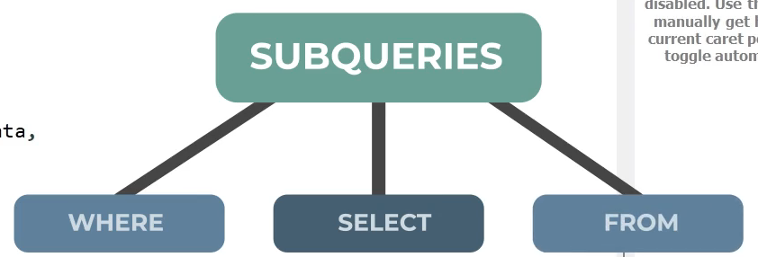

### Subconsultas(subqueries ó subconsultas)

Es una consulta dentro de otra consulta.


Esta es una consulta SQL que utiliza una subconsulta (subquery) para encontrar empleados cuya edad es mayor que el promedio de edad de todos los empleados. Vamos a desglosarla:

Subconsulta interna: (SELECT AVG(edad) FROM empleados)
Calcula el promedio (AVG) de la columna edad de la tabla empleados
Esta subconsulta se ejecuta primero y devuelve un único valor numérico
Consulta principal: SELECT * FROM empleados WHERE edad > [resultado_subconsulta]
Selecciona todos los campos (*) de la tabla empleados
La cláusula WHERE filtra solo los empleados cuya edad es mayor que el promedio calculado

```sql
SELECT * FROM empleados 
WHERE edad > 
	(SELECT  AVG(edad)
	FROM empleados);
```

Las subconsultas permite hace una consulta apartir de otra, es decir el resultado de una consulta se puede usar para filtrar o realizar una consulta.


### Operador in 

Consultar los la cantidad de empleados distintos de la empresa:

```sql
SELECT COUNT(distinct ID_EMPLEADO) FROM empleados; 
```

Contar los empleados presentes en la tabla de venta empleado.
```sql
SELECT COUNT(DISTINCT venta_empleado)
FROM ventas;
```

**IN**: Permite especificar multiples valores en una cláusula WHERE.

Consultar los empleados que no han realizado ventas.
```sql
SELECT nombre,  apellido FROM empleados
WHERE ID_EMPLEADO IN (SELECT DISTINCT venta_empleado FROM ventas);
```

-- Id de empleados con ventas
```sql
SELECT DISTINCT venta_empleado FROM ventas;
```

### JOIN VS SUBCONSULTAS

This query performs a LEFT JOIN between two tables: empleados (employees) and ventas (sales). Here's what it does:

FROM empleados e - Starts with the empleados table and gives it alias 'e'
LEFT JOIN ventas v - Joins with the ventas table (alias 'v')
ON v.venta_empleado = e.ID_empleado - Specifies the join condition matching the employee ID
The key points about this LEFT JOIN:

It will return ALL employees from the empleados table, whether or not they have any sales
If an employee has no sales, their sales-related columns will show as NULL
If an employee has multiple sales, they will appear in multiple rows, once for each sale
This type of query is commonly used to:

See all employees and their associated sales
Identify employees who haven't made any sales (they'll have NULL values in the sales columns)
Get a complete view of employee sales activity, including inactive salespeople.

```sql
SELECT *
FROM empleados e
LEFT JOIN ventas v 
	ON v.venta_empleado = e.ID_empleado; 
```

¿Cual es la diferencia de haberlo hecho con subconsulta y join?

El join me trae mas información, y debo interpretarla, y conocer que significa la informacion que me trae. Con la subconsulta solo me trae la informacion que necesito, y no tengo que interpretarla. Pero le fata la infomacion de quines no vendieron.

```sql
SELECT *
FROM empleados e
LEFT JOIN ventas v 
	ON v.venta_empleado = e.ID_empleado
WHERE v.id_venta IS NULL; 
```

## ALL
**TODO** significa que la condición será verdadera solo si la operación es verdadera para todos los valores en el rango.

Encuéntrame ¿Cuáles alumnos tienen una edad más grande que ALL los maestros?

Aumno cuya edad > a la edad de ALL maestros


'''sql
SELECT * 
FROM VENTAS
WHERE venta > (
	SELECT MAX(venta) 
	FROM ventas
	WHERE ID_local = 2
);

SELECT * 
FROM VENTAS
WHERE venta > ALL (
	SELECT venta 
	FROM ventas
	WHERE ID_local = 2
);
'''

Let me explain these two queries that achieve the same result but use different approaches:

First Query (Using MAX):

```sql
SELECT * 
FROM VENTAS
WHERE venta > (
    SELECT MAX(venta) 
    FROM ventas
    WHERE ID_local = 2
);
```

This query finds all sales that are greater than the highest sale amount from store (local) #2. It:

First calculates the maximum sale amount from store #2 in the subquery
Then returns all sales (from any store) that exceed that maximum value
Second Query (Using ALL):

```sql
SELECT * 
FROM VENTAS
WHERE venta > ALL (
    SELECT venta 
    FROM ventas
    WHERE ID_local = 2
);
```
This query does the same thing but uses the ALL operator. It:

Compares each sale against ALL sales from store #2
Returns sales that are greater than EVERY SINGLE sale from store #2
Both queries will return the same results because:

If a sale is greater than the maximum sale from store #2
It is automatically greater than ALL sales from store #2
The ALL version is more explicit about the comparison being made, while the MAX version is often more efficient as it only needs to compare against a single value.

-- Todas la ventas que son menorea a todas las ventas de del local 4

```sql
SELECT *
FROM ventas
WHERE venta <  ALL(
	SELECT venta
    FROM ventas
    WHERE ID_local = 4
);
```


Esta consulta busca todas las ventas que son MENORES que TODAS las ventas realizadas en la tienda (local) #4. Vamos a desglosarla:

SELECT * FROM ventas - Selecciona todas las columnas de la tabla ventas
WHERE venta < ALL(...) - Filtra las ventas que son menores que TODAS las ventas del subquery
El subquery SELECT venta FROM ventas WHERE ID_local = 4 obtiene todas las ventas de la tienda #4
En otras palabras:

Si la tienda #4 tiene ventas de $100, $200 y $300
Esta consulta encontrará todas las ventas que son menores a $100 (la venta más pequeña de la tienda #4)
Porque para que una venta sea menor que TODAS las ventas de la tienda #4, debe ser menor que la venta más pequeña
Esta consulta también se podría escribir usando MIN en lugar de ALL:

```sql
SELECT *
FROM ventas
WHERE venta < (
    SELECT MIN(venta)
    FROM ventas
    WHERE ID_local = 4
);
```

### ANY
**ANY** Cual quier elemento que cumpla la condicion.

Alumno cuya edad > a la edad ANY los maestros

Alumno cuya edad > a la edad de cualquiera de los maestros

```sql
SELECT *
FROM ventas
WHERE venta > ANY (
	SELECT venta
    FROM ventas
    WHERE id_local = 2
);
```

This query finds all sales that are greater than AT LEAST ONE sale from store (local) #2. Here's how it works:

SELECT * FROM ventas - Selects all columns from the sales table
WHERE venta > ANY(...) - Filters sales that are greater than ANY (at least one) sale from the subquery
The subquery gets all sales from store #2
For example:

If store #2 has sales of $100, $200, and $300
This query will return all sales that are > $100 OR > $200 OR > $300
In other words, any sale above $100 will be included
This is equivalent to using MIN:

```sql
SELECT *
FROM ventas
WHERE venta > (
    SELECT MIN(venta)
    FROM ventas
    WHERE id_local = 2
);
```
## Quieries correlacionadas

¿Cuáles ventas de cada local fueron mayores al promedio de ese local?

```sql
-- Local1 = 777 local2 = 865 local3=849.833 local4=1075.6666
SELECT id_local,AVG(venta)
FROM ventas
GROUP BY id_local;

SELECT *
FROM ventas v
WHERE venta > (
	SELECT AVG(venta)
    FROM ventas
    WHERE ID_local = v.id_local
);
```

Vamos a analizar estas consultas más detalladamente:

Primera Query (Análisis de Promedios por Tienda):

```sql
SELECT id_local, AVG(venta)
FROM ventas
GROUP BY id_local;
```
Esta consulta nos muestra:

Agrupa todas las ventas por tienda (id_local)
Calcula el promedio (AVG) de ventas para cada tienda
Resultados:
Tienda 1: promedio de $777 por venta
Tienda 2: promedio de $865 por venta
Tienda 3: promedio de $849.833 por venta
Tienda 4: promedio de $1,075.6666 por venta
Segunda Query (Consulta Correlacionada Detallada):

```sql
SELECT *
FROM ventas v
WHERE venta > (
    SELECT AVG(venta)
    FROM ventas
    WHERE ID_local = v.id_local
);
```

Esta es una consulta correlacionada que funciona así:

Para CADA FILA de la tabla ventas:
Toma el id_local de esa venta específica
Calcula el promedio de ventas SOLO para esa tienda
Compara si la venta actual es mayor que ese promedio
Por ejemplo, el proceso paso a paso:

Si estamos evaluando una venta de $1000 de la tienda 1:
Calcula el promedio de la tienda 1 ($777)
Compara: $1000 > $777? Sí, entonces incluye esta venta
Si luego evalúa una venta de $800 de la tienda 4:
Calcula el promedio de la tienda 4 ($1075.6666)
Compara: $800 > $1075.6666? No, entonces NO incluye esta venta
Lo que hace especial a esta consulta es que:

Es CORRELACIONADA porque la subconsulta usa información de la consulta principal (v.id_local)
Se ejecuta para CADA FILA de la tabla ventas
Compara cada venta contra el promedio de SU PROPIA tienda, no contra un promedio general
Nos ayuda a identificar las ventas "superiores al promedio" en cada tienda individual

##  Operador EXISTS
Se utiliza para comprobar la existencia de registros en una subconsulta.

Devuelve verdadero si la subconsulta devuelve uno o más redistros.

- Se utiliza para comprobar la existencia de cualquier registro en una subconsulta.
Devuelve VERDADER si la subconsulta devuelve uno o más registros.

Explicame las siguientes consultas:

```sql
SELECT *
FROM empleados
WHERE ID_empleado IN(
	SELECT distinct venta_empleado
    FROM ventas
);

SELECT *
FROM empleados e 
WHERE EXISTS(
	SELECT venta_empleado
	FROM ventas
    WHERE venta_empleado = e.ID_empleado
);

SELECT *
FROM empleados e 
WHERE NOT EXISTS(
	SELECT venta_empleado
	FROM ventas
    WHERE venta_empleado = e.ID_empleado
);

```

Explicación de las Consultas SQL
Consulta 1:

```sql
SELECT *
FROM empleados
WHERE ID_empleado IN(
    SELECT distinct venta_empleado
    FROM ventas
);
```

Explicación: Esta consulta selecciona todos los empleados que han realizado al menos una venta.

La consulta principal selecciona todos los datos de la tabla empleados.
La subconsulta SELECT distinct venta_empleado FROM ventas obtiene una lista única de IDs de empleados que aparecen en la tabla ventas.
El operador IN filtra los empleados cuyo ID está en la lista resultante de la subconsulta.
Resultado: Muestra todos los datos de los empleados que han registrado al menos una venta.
Consulta 2:

```sql
SELECT *
FROM empleados e 
WHERE EXISTS(
    SELECT venta_empleado
    FROM ventas
    WHERE venta_empleado = e.ID_empleado
);
```

Explicación: Esta consulta también selecciona todos los empleados que han realizado al menos una venta, pero usando el operador EXISTS.

La tabla empleados se le asigna el alias e.
El operador EXISTS devuelve TRUE si la subconsulta retorna al menos un registro.
La subconsulta busca en la tabla ventas registros donde venta_empleado coincida con el ID del empleado actual (e.ID_empleado).
Resultado: Funcionalmente equivalente a la primera consulta, pero utiliza una técnica diferente (correlación entre tablas).
Consulta 3:

```sql
SELECT *
FROM empleados e 
WHERE NOT EXISTS(
    SELECT venta_empleado
    FROM ventas
    WHERE venta_empleado = e.ID_empleado
);
```

Explicación: Esta consulta hace lo contrario a las anteriores: selecciona todos los empleados que NO han realizado ninguna venta.

El operador NOT EXISTS devuelve TRUE cuando la subconsulta no retorna ningún registro.
La subconsulta busca en la tabla ventas registros donde venta_empleado coincida con el ID del empleado actual.
Si no encuentra ninguna coincidencia (el empleado no ha realizado ventas), la condición NOT EXISTS se cumple.
Resultado: Muestra todos los datos de los empleados que no han registrado ninguna venta.
Las consultas 1 y 2 son funcionalmente equivalentes pero utilizan diferentes técnicas SQL. La consulta 3 es el complemento lógico de las dos primeras.

- ¿Como se comparan estas ventas con respecto al promedio?

```sql
SELECT 
	id_venta, 
    venta,
    (SELECT AVG(venta) FROM ventas) AS promedio_venta,
    venta - (SELECT promedio_venta)
FROM ventas;
```


Esta consulta está diseñada para comparar cada venta individual con el promedio de todas las ventas. Vamos a analizarla por partes:

id_venta, venta: Selecciona el ID y el monto de cada venta.
(SELECT AVG(venta) FROM ventas) AS promedio_venta: Es una subconsulta escalar que calcula el promedio de todas las ventas en la tabla y lo muestra como una columna llamada "promedio_venta". Esta subconsulta se ejecuta una sola vez para toda la consulta principal.
venta - (SELECT AVG(venta) FROM ventas): Calcula la diferencia entre cada venta individual y el promedio general. Esto muestra cuánto está por encima o por debajo cada venta respecto al promedio.
Si el resultado es positivo, la venta está por encima del promedio
Si el resultado es negativo, la venta está por debajo del promedio
Si el resultado es cero, la venta es exactamente igual al promedio
FROM ventas: Indica que estamos obteniendo los datos de la tabla "ventas".
Nota importante: Hay un error en la consulta original. La última columna debería ser:

```sql
venta - (SELECT AVG(venta) FROM ventas) AS diferencia_del_promedio
En lugar de:
```
```sql
venta - (SELECT promedio_venta)
```
La segunda forma no funcionaría correctamente porque intenta hacer referencia al alias "promedio_venta" dentro de una subconsulta, lo cual no es válido en la mayoría de los sistemas SQL.

Esta consulta es útil para identificar rápidamente qué ventas están por encima o por debajo del promedio, lo que puede ayudar a identificar tendencias o valores atípicos en los datos de ventas.

Las subqueries se pueden usar en cualquier lugar, en el WHERE, en el SELECT, en el FROM, etc.



```sql
SELECT * 
FROM (
	SELECT 
	id_venta, 
    venta,
    (SELECT AVG(venta) FROM ventas) AS promedio_venta,
    venta - (SELECT promedio_venta) AS delta
FROM ventas
) AS PROMEDIO
WHERE delta > 100;
```

Esta consulta utiliza una subconsulta en la cláusula FROM (también conocida como "tabla derivada" o "subconsulta en línea") para encontrar ventas que superan significativamente el promedio. Vamos a analizarla paso a paso:

Subconsulta interna:

```sql
SELECT 
    id_venta, 
    venta,
    (SELECT AVG(venta) FROM ventas) AS promedio_venta,
    venta - (SELECT AVG(venta) FROM ventas) AS delta
FROM ventas;
```

Esta parte:

Selecciona el ID y el monto de cada venta
Calcula el promedio de todas las ventas y lo muestra como columna "promedio_venta"
Calcula la diferencia entre cada venta individual y el promedio, llamándola "delta"
Esta subconsulta genera una tabla temporal con estas cuatro columnas para cada venta
Consulta externa:

```sql
SELECT * 
FROM (...) AS PROMEDIO
WHERE delta > 100;
```

Esta parte:

Toma la tabla temporal generada por la subconsulta y le asigna el alias "PROMEDIO"
Filtra solo las filas donde la columna "delta" es mayor que 100
Selecciona todas las columnas (*) de esas filas filtradas
Resultado final:
La consulta completa devuelve todas las ventas cuyo monto supera al promedio general por más de 100 unidades monetarias. Esto permite identificar fácilmente las ventas significativamente superiores al promedio.

Observación importante:
Al igual que en la consulta anterior, hay un error en la referencia a (SELECT promedio_venta). La forma correcta sería:

```sql
venta - (SELECT AVG(venta) FROM ventas) AS delta
```

Esta consulta es un buen ejemplo de cómo las subconsultas pueden usarse en la cláusula FROM para crear tablas derivadas temporales que luego pueden filtrarse o manipularse en la consulta externa.

## Ejercicios

Operador IN

Las Subqueries se pueden añadir en diferentes lugares de la consulta, es importante entender bien que tus base de datos y usar las columnas de identificadores.

Crear una subquery para generar:

1 Los vendedores que no vendieron en 2018:

```sql
SELECT *
FROM empleados
WHERE ID_empleado NOT IN(
	SELECT venta_empleado
    FROM ventas
    WHERE YEAR(fecha) = 2018
);
```

2. Productos que no se vendieron en marzo del 2017:

```sql
SELECT *
FROM productos
WHERE producto_id NOT IN(
	SELECT clave_producto
    FROM ventas
    WHERE MONTH(fecha) = 3 AND YEAR(fecha) = 2017
);
```

3. Clientes que compraron propiedades de remates Bancarios en el primer cuarto de 2016:

```sql
SELECT *
FROM clientes
WHERE id_cliente IN(
	SELECT id_cliente
    FROM ventas v
    JOIN productos p USING(id_producto)
    WHERE p.id_producto = 7
    AND MONTH(v.fecha_venta) BETWEEN 1 AND 3 
    AND YEAR(v.fecha_venta) = 2016
) 
ORDER BY id_cliente ASC;
```

o 

```sql
SELECT *
FROM clientes
WHERE id_cliente IN(
	SELECT id_cliente
    FROM ventas v
    JOIN productos p USING(id_producto)
    WHERE p.producto = "Remates"
    AND MONTH(v.fecha_venta) BETWEEN 1 AND 3 
    AND YEAR(v.fecha_venta) = 2016
) 
ORDER BY id_cliente ASC;
```

