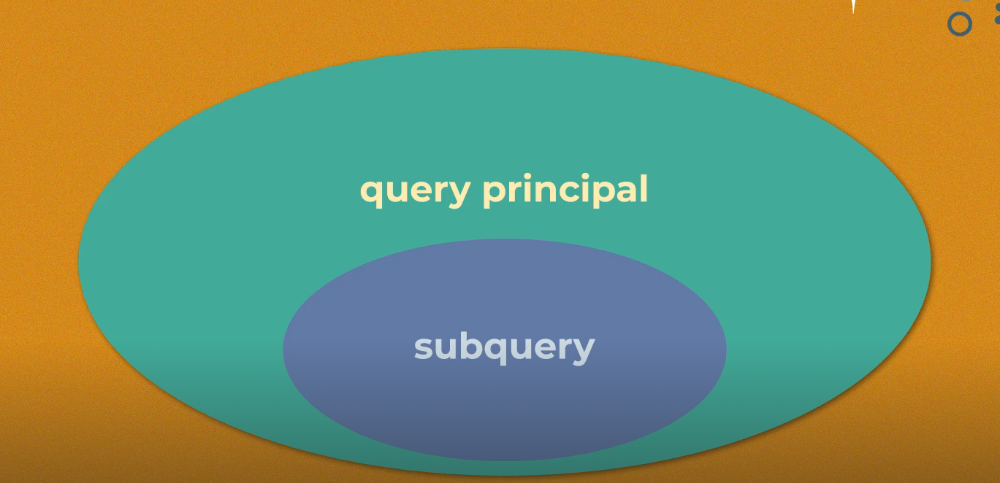

### Subconsultas(subqueries ó subconsultas)

Es una consulta dentro de otra consulta.



Esta es una consulta SQL que utiliza una subconsulta (subquery) para encontrar empleados cuya edad es mayor que el promedio de edad de todos los empleados. Vamos a desglosarla:

Subconsulta interna: (SELECT AVG(edad) FROM empleados)
Calcula el promedio (AVG) de la columna edad de la tabla empleados
Esta subconsulta se ejecuta primero y devuelve un único valor numérico
Consulta principal: SELECT * FROM empleados WHERE edad > [resultado_subconsulta]
Selecciona todos los campos (*) de la tabla empleados
La cláusula WHERE filtra solo los empleados cuya edad es mayor que el promedio calculado

```sql
SELECT * FROM empleados 
WHERE edad > 
	(SELECT  AVG(edad)
	FROM empleados);
```

Las subconsultas permite hace una consulta apartir de otra, es decir el resultado de una consulta se puede usar para filtrar o realizar una consulta.


### Operador in 

Consultar los la cantidad de empleados distintos de la empresa:

```sql
SELECT COUNT(distinct ID_EMPLEADO) FROM empleados; 
```

Contar los empleados presentes en la tabla de venta empleado.
```sql
SELECT COUNT(DISTINCT venta_empleado)
FROM ventas;
```

**IN**: Permite especificar multiples valores en una cláusula WHERE.

Consultar los empleados que no han realizado ventas.
```sql
SELECT nombre,  apellido FROM empleados
WHERE ID_EMPLEADO IN (SELECT DISTINCT venta_empleado FROM ventas);
```

-- Id de empleados con ventas
```sql
SELECT DISTINCT venta_empleado FROM ventas;
```

### JOIN VS SUBCONSULTAS

This query performs a LEFT JOIN between two tables: empleados (employees) and ventas (sales). Here's what it does:

FROM empleados e - Starts with the empleados table and gives it alias 'e'
LEFT JOIN ventas v - Joins with the ventas table (alias 'v')
ON v.venta_empleado = e.ID_empleado - Specifies the join condition matching the employee ID
The key points about this LEFT JOIN:

It will return ALL employees from the empleados table, whether or not they have any sales
If an employee has no sales, their sales-related columns will show as NULL
If an employee has multiple sales, they will appear in multiple rows, once for each sale
This type of query is commonly used to:

See all employees and their associated sales
Identify employees who haven't made any sales (they'll have NULL values in the sales columns)
Get a complete view of employee sales activity, including inactive salespeople.

```sql
SELECT *
FROM empleados e
LEFT JOIN ventas v 
	ON v.venta_empleado = e.ID_empleado; 
```

¿Cual es la diferencia de haberlo hecho con subconsulta y join?

El join me trae mas información, y debo interpretarla, y conocer que significa la informacion que me trae. Con la subconsulta solo me trae la informacion que necesito, y no tengo que interpretarla. Pero le fata la infomacion de quines no vendieron.

```sql
SELECT *
FROM empleados e
LEFT JOIN ventas v 
	ON v.venta_empleado = e.ID_empleado
WHERE v.id_venta IS NULL; 
```

## ALL
**TODO** significa que la condición será verdadera solo si la operación es verdadera para todos los valores en el rango.

Encuéntrame ¿Cuáles alumnos tienen una edad más grande que ALL los maestros?

Aumno cuya edad > a la edad de ALL maestros


'''sql
SELECT * 
FROM VENTAS
WHERE venta > (
	SELECT MAX(venta) 
	FROM ventas
	WHERE ID_local = 2
);

SELECT * 
FROM VENTAS
WHERE venta > ALL (
	SELECT venta 
	FROM ventas
	WHERE ID_local = 2
);
'''

Let me explain these two queries that achieve the same result but use different approaches:

First Query (Using MAX):

```sql
SELECT * 
FROM VENTAS
WHERE venta > (
    SELECT MAX(venta) 
    FROM ventas
    WHERE ID_local = 2
);
```

This query finds all sales that are greater than the highest sale amount from store (local) #2. It:

First calculates the maximum sale amount from store #2 in the subquery
Then returns all sales (from any store) that exceed that maximum value
Second Query (Using ALL):

```sql
SELECT * 
FROM VENTAS
WHERE venta > ALL (
    SELECT venta 
    FROM ventas
    WHERE ID_local = 2
);
```
This query does the same thing but uses the ALL operator. It:

Compares each sale against ALL sales from store #2
Returns sales that are greater than EVERY SINGLE sale from store #2
Both queries will return the same results because:

If a sale is greater than the maximum sale from store #2
It is automatically greater than ALL sales from store #2
The ALL version is more explicit about the comparison being made, while the MAX version is often more efficient as it only needs to compare against a single value.

-- Todas la ventas que son menorea a todas las ventas de del local 4

```sql
SELECT *
FROM ventas
WHERE venta <  ALL(
	SELECT venta
    FROM ventas
    WHERE ID_local = 4
);
```


Esta consulta busca todas las ventas que son MENORES que TODAS las ventas realizadas en la tienda (local) #4. Vamos a desglosarla:

SELECT * FROM ventas - Selecciona todas las columnas de la tabla ventas
WHERE venta < ALL(...) - Filtra las ventas que son menores que TODAS las ventas del subquery
El subquery SELECT venta FROM ventas WHERE ID_local = 4 obtiene todas las ventas de la tienda #4
En otras palabras:

Si la tienda #4 tiene ventas de $100, $200 y $300
Esta consulta encontrará todas las ventas que son menores a $100 (la venta más pequeña de la tienda #4)
Porque para que una venta sea menor que TODAS las ventas de la tienda #4, debe ser menor que la venta más pequeña
Esta consulta también se podría escribir usando MIN en lugar de ALL:

```sql
SELECT *
FROM ventas
WHERE venta < (
    SELECT MIN(venta)
    FROM ventas
    WHERE ID_local = 4
);
```

### ANY
**ANY** Cual quier elemento que cumpla la condicion.

Alumno cuya edad > a la edad ANY los maestros

Alumno cuya edad > a la edad de cualquiera de los maestros

```sql
SELECT *
FROM ventas
WHERE venta > ANY (
	SELECT venta
    FROM ventas
    WHERE id_local = 2
);
```

This query finds all sales that are greater than AT LEAST ONE sale from store (local) #2. Here's how it works:

SELECT * FROM ventas - Selects all columns from the sales table
WHERE venta > ANY(...) - Filters sales that are greater than ANY (at least one) sale from the subquery
The subquery gets all sales from store #2
For example:

If store #2 has sales of $100, $200, and $300
This query will return all sales that are > $100 OR > $200 OR > $300
In other words, any sale above $100 will be included
This is equivalent to using MIN:

```sql
SELECT *
FROM ventas
WHERE venta > (
    SELECT MIN(venta)
    FROM ventas
    WHERE id_local = 2
);
```
## Quieries correlacionadas

¿Cuáles ventas de cada local fueron mayores al promedio de ese local?

```sql
-- Local1 = 777 local2 = 865 local3=849.833 local4=1075.6666
SELECT id_local,AVG(venta)
FROM ventas
GROUP BY id_local;

SELECT *
FROM ventas v
WHERE venta > (
	SELECT AVG(venta)
    FROM ventas
    WHERE ID_local = v.id_local
);
```

Vamos a analizar estas consultas más detalladamente:

Primera Query (Análisis de Promedios por Tienda):

```sql
SELECT id_local, AVG(venta)
FROM ventas
GROUP BY id_local;
```
Esta consulta nos muestra:

Agrupa todas las ventas por tienda (id_local)
Calcula el promedio (AVG) de ventas para cada tienda
Resultados:
Tienda 1: promedio de $777 por venta
Tienda 2: promedio de $865 por venta
Tienda 3: promedio de $849.833 por venta
Tienda 4: promedio de $1,075.6666 por venta
Segunda Query (Consulta Correlacionada Detallada):

```sql
SELECT *
FROM ventas v
WHERE venta > (
    SELECT AVG(venta)
    FROM ventas
    WHERE ID_local = v.id_local
);
```

Esta es una consulta correlacionada que funciona así:

Para CADA FILA de la tabla ventas:
Toma el id_local de esa venta específica
Calcula el promedio de ventas SOLO para esa tienda
Compara si la venta actual es mayor que ese promedio
Por ejemplo, el proceso paso a paso:

Si estamos evaluando una venta de $1000 de la tienda 1:
Calcula el promedio de la tienda 1 ($777)
Compara: $1000 > $777? Sí, entonces incluye esta venta
Si luego evalúa una venta de $800 de la tienda 4:
Calcula el promedio de la tienda 4 ($1075.6666)
Compara: $800 > $1075.6666? No, entonces NO incluye esta venta
Lo que hace especial a esta consulta es que:

Es CORRELACIONADA porque la subconsulta usa información de la consulta principal (v.id_local)
Se ejecuta para CADA FILA de la tabla ventas
Compara cada venta contra el promedio de SU PROPIA tienda, no contra un promedio general
Nos ayuda a identificar las ventas "superiores al promedio" en cada tienda individual