### Trabajar con más de una Tabla

#### Cláusula JOIN
Se utiliza para combinar filas de dos o más tablas, basadas en una columna relacionada entre ellas.

Unir una tabla ventas (la tabla interna) con la tabla local (la tabla externa), sql me dide una letra para hacer referencia a esa tabla, la primera letra del nombre de la tabla por lo regular.

### ON
```
JOIN local (ON) 
```
Sobre que columna vamos a emparejarlas.
No existen reglas definidas para seleccionar las columnas donde se emparejan, se debe selecionar en base al conocimiento de la base de datos propia y el filling para saber cuales son las dos columnas que unen las tablas, 
generalmente es una clase clave o identificador.


La siguiente query, selecciona todo de la tabla ventas y lo une con la tabla local en donde el ID_local de ventas y el ID_Local  de local, son el mismo. 

```
SELECT *
FROM ventas v
JOIN local l 
	ON v.ID_local = l.ID_LOCAL;
```
La siguiente query, selecciona todo de la tabla ventas y lo une con la tabla local en donde el ID_local de ventas y ID_Local de local, son el mismo, y une la tabla ventas con la tabla empleados donde venta_empleado de la tabla ventas es igual al ID_empleado de la tabla empleado

```
SELECT *
FROM ventas v
JOIN local l
    ON v.ID_local = l.ID_Local
JOIN empleados e
    ON v.venta_empleado = e.ID_empleado;
```

De la consulta anterior depuramos la información, vamos a traer de la tabla ventas el campo ventas_id, fecha, clave_producto, ventya, de la tabla local el Direccion y de la tabla empleado el nombre y el apellido.

```
SELECT 
    v.ventas_id,
    v.fecha,
    l.domicilio,
    v.clave_producto,
    v.venta,
    e.nombre,
    e.apellido
FROM ventas v
JOIN local l
    ON v.ID_local = l.ID_Local
JOIN empleados e
    ON v.venta_empleado = e.ID_empleado;
```

#### ¿Qué pasa cuando tu tienes que hacer JOINS?

De dos Schemas diferentes:
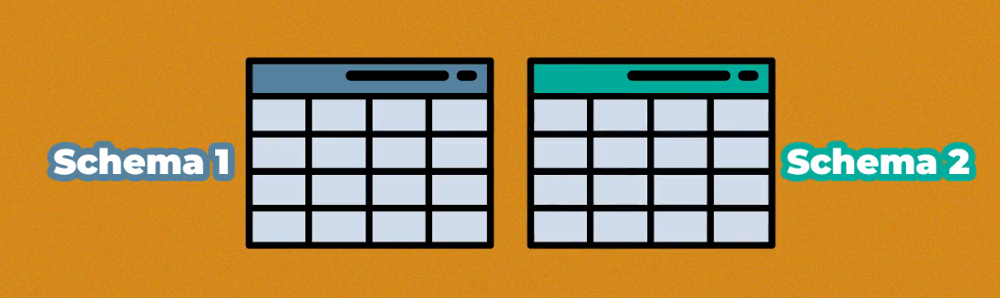

Cuando deseamos realizar una Query de un Schema diferente al que encuantro seleccionado se debe hacer referencia al Schema, es decir se debe seleccionar el nombre_del_schema.nombre_tabla:

Esta seleccionado el schema biblioteca:
```
USE  biblioteca;
```
Pero de esta forma podemos consultar de un schema diferente como datos atravez de acceder por el punto datos.empleados:
```
SELECT *
FROM datos.empleados;
```
Como utilizar JOIN con tablas de diferentes schemas, para eso se usa la referencia al schema y el nombre de la tabla es decir nombre_schema.nombre tabla.

```
SELECT *
FROM periodo1 p
JOIN datos.empleados e
    ON p.ID_empleado = e.ID_empleado;
```

Para solo seleccionar las columnas deseadas de esas tablas, las columnas periodo1_ID, Fecha, el Nombre del empleados, el Apellido de empleados y el Local y Turno_completo de periodo1:

```
SELECT 
    p.periodo1_ID,
    p.Fecha,
    e.Nombre,
    e.Apellido,
    p.Local,
    p.Turno_completo
FROM periodo1 p
JOIN datos.empleados e
    ON p.ID_empleado = e.ID_empleado;
```
La siguiente consulta trae las columnas periodo1_ID, Fecha, Turno_completo del schema periodos de la tabla periodo1, la tabla empleado del schema datos traer Nombre y Apellido, de las tablas periodo1 de periodo traer el local y local de datos la direccion toso uniendo periodo1 con empleado en donde el ID_empleado y ID_empleado de empleado en datos son iguales y unimos con datos de local, en donde local de periodo1 es igual a la letra_zon del local en datos:

```
USE periodos;

SELECT 
    p.periodo1_ID,
    p.Fecha,
    e.Nombre,
    e.Apellido,
	CONCAT(p.Local, ' ', l.Direccion) AS local,
    p.Turno_completo
FROM periodo1 p
JOIN datos.empleados e
    ON p.ID_empleado = e.ID_empleado
JOIN datos.local l    
    ON p.Local = l.Letra_zona;
```
#### Self-JOIN
Unir una tabla unida con si misma.
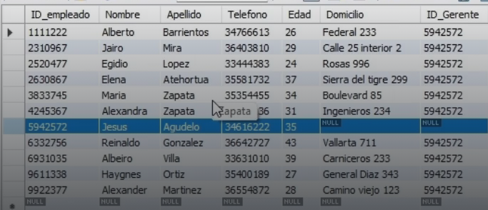

Expliación de la problematica, ID_gerente de la tabla empleados es a su vez es un 
ID_empleado, si queremos colocar en una consulta el nombre del gerente se debe consultar asi misma con un self JOIN a la misma tabla en en el ID_empleado = ID_Gerente:`


```
SELECT 
	e.ID_empleado,
    e.Nombre,
    e.Apellido,
    e.Telefono,
    e.edad,
    e.Domicilio,
    concat(p.Nombre, ' ', p.Apellido) AS Nombre_gerente
FROM empleados e
JOIN empleados p ON e.ID_Gerente = p.ID_empleado;
```

Sin embargo el gerente no aparece en la lista de empleados este al no tener gerente, para que el gerente aparezca debe estar presente el gerente se usa un LEFT JOIN:
```
SELECT 
	e.ID_empleado,
    e.Nombre,
    e.Apellido,
    e.Telefono,
    e.edad,
    e.Domicilio,
    concat(p.Nombre, ' ', p.Apellido) AS Nombre_gerente
FROM empleados e
LEFT JOIN empleados p ON e.ID_Gerente = p.ID_empleado;
```
### Inner JOIN 
Es una relacionde la tabla izquierda con los elementos que coinciden en la tabla derecha la coincidencia se realiza en el id de estato con el idEstado de la tabla ciudad, solo traera como resultado de la consulta los elementos que coinciden los que no son null 
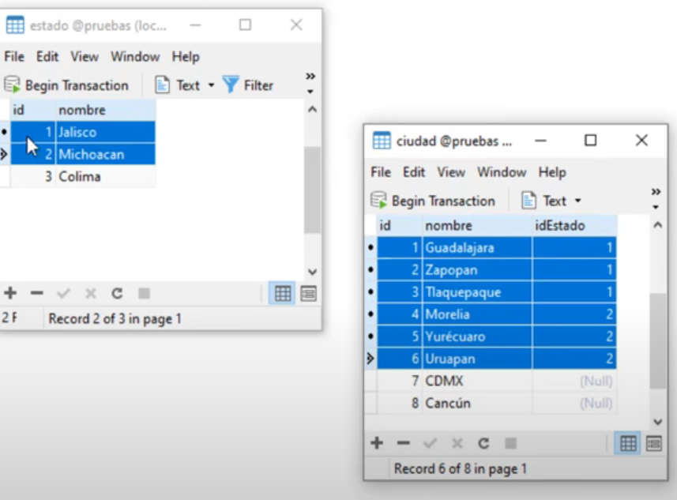

La consulta seria de la siguiente forma
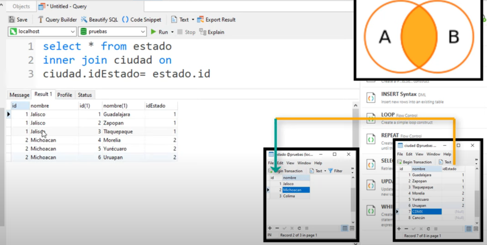

El LEFT JOIN nos daria todo el resultado de la izquierda siendo la izquirda la tabla de estados, a pezar de que no exista en la parte derecha en la parte de ciudades.

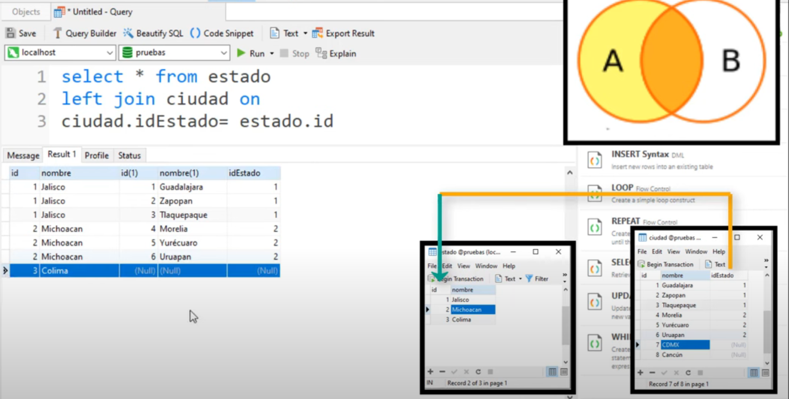

El RIGHT JOIN por lo contrareo, nos daria como rexultado todo lo de la tabla derecha siendo la tabla derecha ciudades, a pezar que no exista en la parte de la tabla de estados:
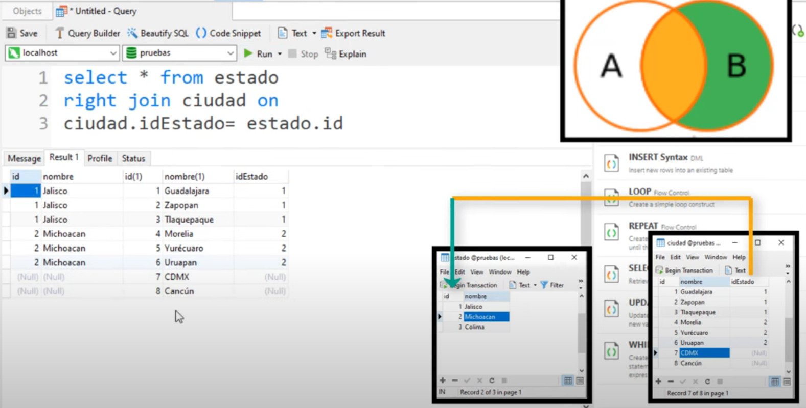

El full JOIN no esta soportado en maria db o mysql, pero para poder simularlo, podemos 
traer todo lo del lado izquierdo con LEFT JOIN y unirlo con todo lo del lado derecho RIGHT JOIN, como se muestra a continuación:

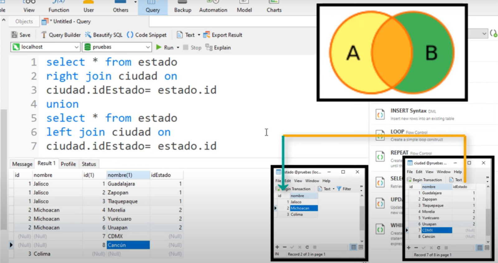 

-- En resumen 
-- EN JOIN juntamos los datos que coinciden ambas tablas:


-- En los JOIN Externos, juntamos todos los datos de alguna tabla con los que coinciden en la otra tabla (LEFT o RIGHT):
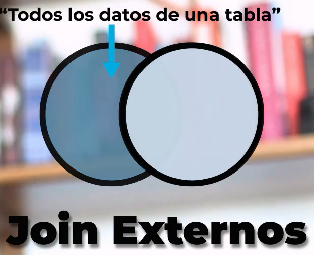

### JOINS externos
De la tabla ventas, ¿Cómo se yo que todos los empleados participaron en la venta?

La siguiente consulta trae todas las ventas por empleado:
```
SELECT *
FROM ventas v
JOIN empleados e
	ON v.venta_empleado = e.ID_empleado;
```
Pero presenta el problema que si el el empleado no tiene venta no lo muestra para solucionarlo debemos usar RIGHT JOIN, porque traera todo lo de la tabla derecha y lo que coincide con la tabla izquierda ventas aunque eten vacias:
```
SELECT *
FROM ventas v
RIGHT JOIN empleados e
    ON v.venta_empleado = e.ID_empleado;
```

Si lo hacemos de forma contrarea traemos todo de la tabla izquierda, con usu coincidencia con la derecha en donde los ide de empleado en venta y empleado coinciden con un LEFT JOIN:
```
SELECT *
FROM ventas v
RIGHT JOIN empleados e
    ON v.venta_empleado = e.ID_empleado;
```
Se trae todas la ventas aunque estas no tengan vendedor.

### Cláusula using
Utilizada para hacer coincidir una sola columna de las tablas que se van a unir.

Ejemplo:

La query completa seria:
```
SELECT * 
FROM ventas v
JOIN local l ON v.ID_local = l.ID_local;
```

#### USING 
Utiizada pa hacer coincidir  una sola columna de las tablas que se van a unir.

Ejemplo de uso de using, cuando tenemos los dos mismos nombre de columna, como arriba:

```
SELECT *
FROM ventas v
JOIN local l  USING(ID_local);
```
#### Cross Join 
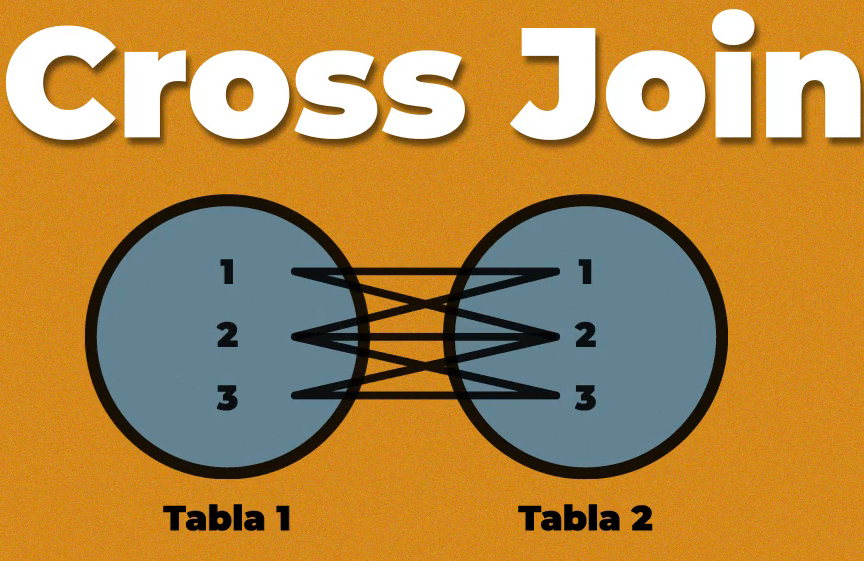
Mezcla todos con todos, no es un a unión como tal sino un cruze de valores.

Vamos hace un cross join entre ingredintes y productos, (va agarrar todos los registros u los va pegar todos con todos), si tengo 6 ingredientes y cuatro productos el resultado seria 24 filas:
```
SELECT * 
FROM productos p
CROSS JOIN ingredientes i;
```
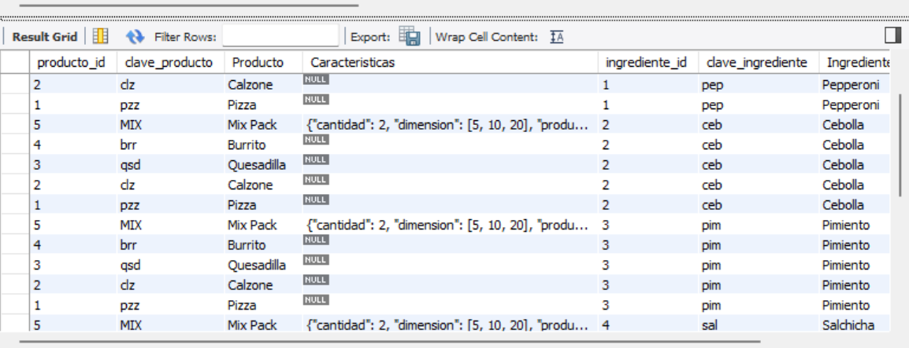

### Natural Join
Misma unión del tipo **INNER** o **LEFT JOIN**. En este caso la cláusula ON se refiere a todas las columnas en común con las tablas, busca dos columnas en las tablas que se llamen igual y sobre esa realiza la unión.

-- Ejemplo donde si funciona (Funciono por que ambos tienen el mismo nombre de columna):
```
SELECT *
FROM ventas v NATURAL JOIN local l;

```
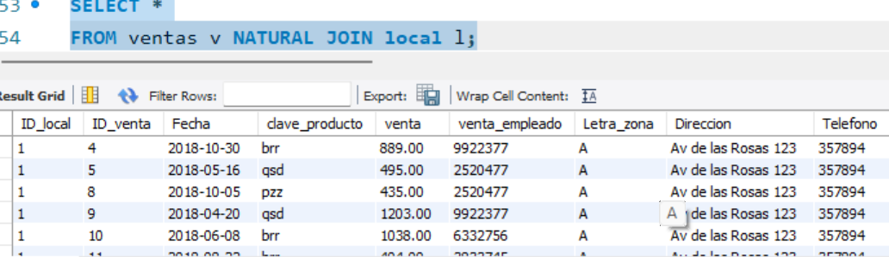

-- Ejemplo donde no funciona (como no tienen columnas con nombres iguales trae basicamente un cross join de todas las ventas con todos los empleados):
```
SELECT *
FROM ventas v NATURAL JOIN empleados e; 
```
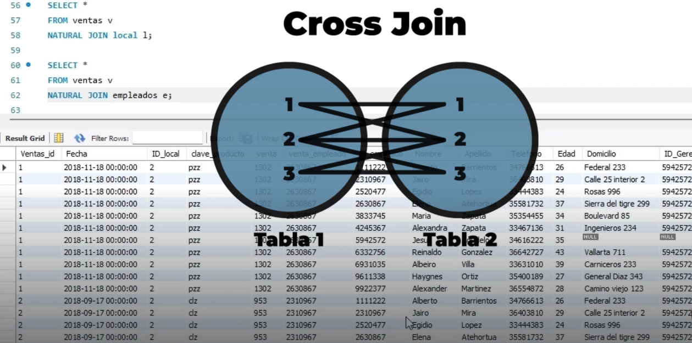

### La cláusula UNION:
Utilizada para combinar los resultados de dos o más cláusulas SELECT.
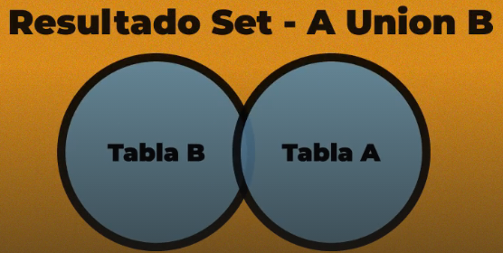

Ejemplo unir la columna productos de Productos y la columna ingredientes de ingredientes:
```
SELECT Producto
FROM productos
UNION
SELECT ingredientes
FROM ingredientes;
```

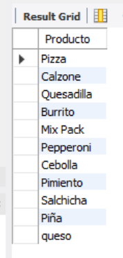

La **REGLA** al usar unión es que no puedo tener una cantidad diferente de columnas.

### EJERCICIOS JOINS:

Importante:
-   En FROM usamos la tabla principal.
-   Sintaxis: JOIN __ ON A=B
-   Para evitar un código engorroso podemos abreviar la tabla en FROM o en JOIN.
-   Para usar eñ JOIN entre varias bases de datos (SCHEMAS) usan el sintaxis correcto:
BaseDeDatos.Tabla

Imagina que vas a preparar un análisis de ventas tienes que entregar 2 columnas por vista con la descripción de:

1. Ventas por cliente:
```
SELECT 
	v.venta,
    c.Nombre
FROM ventas v 
JOIN clientes c ON v.ID_Cliente = c.ID_Cliente;
```
o
```
SELECT 
	v.venta,
    c.Nombre
FROM ventas v 
JOIN clientes c USING(ID_Cliente);
```
2. Ventas por zona:
```
SELECT 
    v.Venta,
    z.Zona
FROM ventas v
JOIN zonas z ON v.ID_Zona = z.ID_zona; 
```
3. Ventas por vendedor:
```
SELECT 
    v.Venta,
    CONCAT(s.Nombre, ' ', s.Apellido) as Nombre_Vendedor
FROM ventas v
JOIN vendedores s ON v.ID_Vendedor = s.ID_Vendedor; 
```
o 
```
SELECT 
    v.Venta,
    CONCAT(s.Nombre, ' ', s.Apellido) as Nombre_Vendedor
FROM ventas v
JOIN vendedores s USING(ID_Vendedor); 
```

4. Ventas por producto:
```
SELECT 
	v.Venta,
    p.Producto
FROM ventas v
JOIN productos p ON  v.ID_producto = p.ID_Producto;
```
### Múltiples tablas **JOIN**

Importante:
    -   WHERE: filtra datos.
    -   Todos los operadores de comparación.
    -   Filtra para un texto en espécifico(comillas).

Genera una vista con la descripción que conecta:

1. Informacion por ventas con cliente y vendedor:
```
SELECT
    v.venta,
    c.nombre,
    ve.nombre AS vendedor
FROM ventas v
JOIN clientes c ON v.ID_cliente = c.ID_cliente
JOIN vendedores ve ON v.ID_Vendedor = ve.ID_Vendedor;
```
2. Otra para la venta por cliente y zona y producto:
```
SELECT 
    v.venta,
    c.nombre,
    z.Zona,
    p.Producto
FROM ventas v
JOIN clientes c ON v.ID_cliente = c.ID_cliente
JOIN zonas z ON v.ID_Zona = z.ID_zona
JOIN productos p ON v.ID_producto = p.ID_producto;
```

### Usar JOIN Externo:
Notas: Necesitaremos el uso de un JOIN externo, ya que dependerá del orden que les des a las tablas en el código.

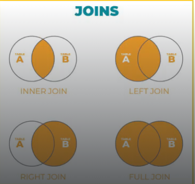

1. Encontrar al vendedor que no ha vendido nada:
Para eso traemos como tabla izquierda a la venta y derecha a la vendedores donde unimos de forma a externa de derecha para que invoquen a todos los vendedores, apesar de que estos no tengan ventas para hacer esto lo hacemos donde v.ID_Vendedor = ve.ID_vendedor
```
SELECT 
    v.venta,
    CONCAT(ve.Nombre, ' ', ve.Apellido) AS Vendedor_Name
FROM ventas v
RIGHT JOIN vendedores ve ON v.ID_Vendedor = ve.ID_vendedor
WHERE v.venta IS NULL;
```
o

```
SELECT 
    v.venta,
    CONCAT(ve.Nombre, ' ', ve.Apellido) AS Vendedor_Name
FROM ventas v
RIGHT JOIN vendedores ve ON v.ID_Vendedor = ve.ID_vendedor
ORDER BY v.venta;
```
### Instrucción USING

Nota: Con **USING** es importante que los nombres de la columnas tengan el mismo nombre.

Genera una vista con la descripción:

1.  Venta con el cliente y zona:
```
SELECT 
    v.venta,
    c.Nombre,
    z.Zona
FROM ventas v
JOIN clientes c USING(ID_Cliente)
JOIN zonas z USING(ID_Zona);
```

2. Venta con vendedor y procucto
```
SELECT 
    v.Venta,
    CONCAT(ve.Nombre,' ', ve.Apellido) AS Vendedor,
    p.Producto
FROM ventas v
JOIN vendedores ve USING(ID_Vendedor)
JOIN productos p USING(ID_producto);
```

### CROSS JOIN

**Cross Join** nos deja crear combinaciones posibles entre tablas, existe la forma implícita usando el nombre de las tablas en FROM.

Genera una vista para traer todas la combinaciones de:

1. Nombre de productos y nombre de clientes:

```
SELECT 
    p.Producto,
    c.Nombre
FROM productos p
CROSS JOIN clientes c;
```

### Usando UNION

-   Para usar **UNION** puede ser con la misma tabla o con una diferente, ten en cuanta que tienen que tener la misma cantidad de columnas.

1.  Una vista con clientes que tenga la calificación "A" y "B".
```
SELECT Nombre FROM clientes WHERE clasificacion_credito = 'A'
UNION
SELECT Nombre FROM clientes WHERE clasificacion_credito = 'B';
```

2.  Lista de vendedores que estén casados y sean mayores de 50 años con los vendedores solteros menores de 30

```
SELECT nombre, apellido 
FROM vendedores WHERE edad > 50 and Estado_Civil = 'Casado'
UNION
SELECT nombre, apellido
FROM vendedores WHERE edad <30 and Estado_Civil = 'Soltero';
```

