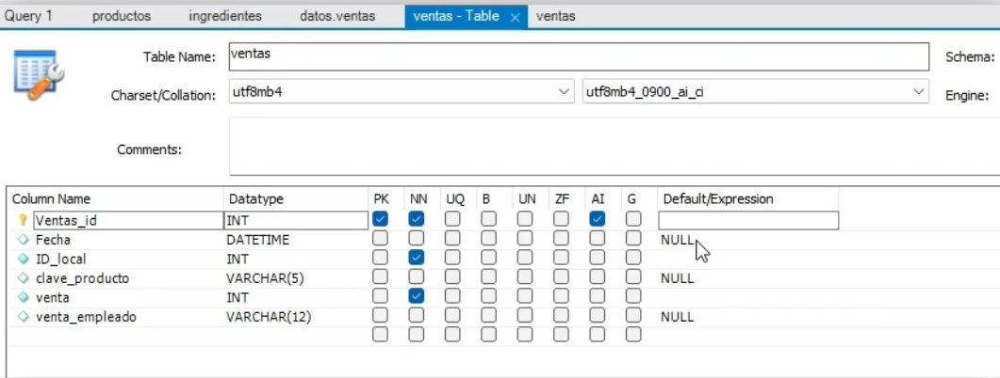

### Atributos de columnas

Las propiedades de cada columna que tienen en MySQL



#### Charset/Collation
Que tipo de caracteres soporta la tabla, incluye la codificación de caracteres, decir la codificación de caracteres de USA es diferenta a latinoamerica, el lationo es utf8mb4. 

#### Column Name

-   **Clave primaria(primary key)**: La columna con llave es la columna mas importante de la tabla, en una fila nueva simpre debe ir rellena. La llave primaria es unica e irrepetible.

En el caso de la tabla podemos tener mas de un Joven con el mismo nombre, por lo que la llave primaria es el identificador unico que nos permite identificarlo apezar de que existan mas elementos con el mismo nombre, la llave primaria seleccionada seria el ID.

**Clave primaria**: E una base de datos relacional es una columna que distingue a cada uno de los registros de la base.


-   **Default/Expression**: podemos defiinir un valor por defecto que se le dara al campo al momento de su creación.

### Tipos de datos

En SQL tenemos tres grandes familias de tipos de datos:
1.  Numérico.
2.  String
3.  Nógico


#### Numérico
-   **INT**: Valor numerico sin decimales, ignora todo despues del punto.
-   **FLOAT/DOUBLE/DECIMAL**: Guardar números decimales en cierto caso es necesario indicar cuantas posiciones.

#### String (cadenas de texto)

-   **VARCHAR**: De longitud variable. Hasta 256 caracteres. Es necesario especificar el máximo de caracteres. VARCHAR 12 -> Significa que solo acepta 12 caracteres.
-   **CHAR**: De longitud fija 255 caracteres.
-   **TEXT**: Ambos permiten grandes longitudes de texto, los cuales no son permitidas en CHAR/VARCHAR. Ejemplos, cartas, mails, resñas y comentarios.


#### Lógicos (todo los que no son númericos o strings):
-   **BOOLEAN**: Guarda valores de verdadero falso. TRUE y FALSE, respectivamente.
-   **DATETIME/TIMESTAMP**: Guarda fechas, en formato YYYY-MM-DD
-   **TIME**:   Guardar tiempo, en formato hh:mm:ss

Siempre se debe especificar los tipos de datos  estos. 

#### Atributos de columna
|Abreviatura|Atributo|
|-|-|
|PK|**Primary Key**: Identificador distintivo de cada registro|
|NN|**Not NULL**: No se pueden tener registros con null dentro de esta columna|
|UQ|**Unique Index**: Garantiza que las columnas de clave primaria no contencan valores duplicados|
|B|**is Binary**: Datos binarios, como : TRUE o FALSE|
|UN|**Unsigned Data Type**: El valor de los registros solo puede ser positivo.|
|ZF|**zero fill up**: Rellena los valores con 0, si el ipo de dato es numérico.|
|AI|**Auto Incremental**: Valores que incrementan en automático en caso de colocar nuevos registros|
|G|**Generated column**: No se pueden modificar sus valores manualmente|

### Insertar filas nuevas en SQL:

```
use datos;
```

Primero alteramos la tabla de ingredientes para que precio_porcion sea NULL por defecto el valor.
```
ALTER TABLE ingredientes
CHANGE COLUMN precio_porcion precio_porcion INT NULL DEFAULT NULL;
```

#### INSERT INTO
Utilizado para ingresar nuevos registros a la tabla.

Insertamos en ingredientes Aceituna
```
INSERT INTO ingredientes(Ingredientes) VALUES ("Aceituna");
```

Commit -> es realizar las modificaciones en la base de datos 

Para actualizar los campos del registro de aceituna:

```
UPDATE `datos`.`ingredientes` SET `clave_ingrediente` = 'act', `precio_porcion` = '10' WHERE (`ingrediente_id` = '7');

```

Insertar un nuevo registro con todos los campos completos:
Insertar un ingrdiente llamado Pollo, abreviado con pl y precio 15:
```
INSERT INTO ingredientes (Ingredientes, precio_porcion, clave_ingrediente) VALUES ('Pollo', 15, 'pll');
```

#### Insertar multiples ingredientes:

Insertamos los ingredientes, Jamon, BBQ, J. Serrano.

```
INSERT INTO ingredientes(ingredientes) 
VALUES ("Jamon"),("BBQ"),("J. Serrano");
```
 
Insertamos nuevos ingredientes, con todos los ingredientes.

```
INSERT INTO ingredientes(Ingredientes, precio_porcion, clave_ingrediente) 
VALUES ('Champiñon', 15, 'Chp'), ('Queso cabra', 13, 'qu');
```

### Introducir datos en varias tablas

Las tablas ventas y venta_detalle , con una tabla padre hijo y una tabla hija venta_detalle:

Insertar una venta:
```
INSERT INTO ventas(ID_local, clave_producto, venta) VALUES (2, 'pzz', 233);
```

#### LAST_INSERT_ID:
Devuelve el ID de la última inseción o registroque es auto incrementable. Sillono le especifico las columnas me pide todo el detalle de las columnas, llenar todos los campos.

```
INSERT INTO venta_detalle
VALUE(last_insert_id(),LAST_INSERT_ID(), "Llevar");
```

### Copiar una tabla

#### CREATE TABLE:
Utilizada para crear una nueva tabla en un esquema o base de datos.

```
CREATE TABLE archivos_ventas AS
SELECT * FROM ventas;
```
Visualizar la tabla copia:
```
SELECT * FRom archivos_ventas;
```

#### TRUNCATE TABLE:
Elimina los **registros** de una tabla por completo.
```
TRUNCATE TABLE archivos_ventas;
```

Insertar todos los archivos de la tabla ventas:
```
INSERT INTO archivos_ventas 
SELECT *
FROM ventas;
```

Insertar elementos aplicando un filtro:
```
INSERT INTO archivos_ventas 
SELECT *
FROM ventas WHERE venta > 1000;
```

### Actualizar filas y registros

#### UPDATE:
Utilizada para modificar registros existentes de la tabla.


Modificamos el ingrediente como Pina y la clave a pin del elemento con el id = 5
```
UPDATE ingredientes
SET ingredientes = "Pina", clave_ingrediente="pin"
WHERE ingrediente_id = 5;
```

Modificar muchos registros
```
UPDATE ventas
SET venta = 777
WHERE ID_local = 1;
```
### Actualizar utilizando subconsultas

Seleccionar el id del local D: 
```
SELECT ID_Local 
FROM local
WHERE letra_zona = "D";
```

Usarlo para actualizar de archivo_ventas el iva del id del local D:
```
SET SQL_SAFE_UPDATES = 0;

-- Tu consulta UPDATE aquí
UPDATE archivos_ventas
SET venta = venta * 1.16
WHERE ID_local = 
    (SELECT ID_local
    FROM local
    WHERE letra_zona="D");

SET SQL_SAFE_UPDATES = 1;
```

Para dos zonas seria:
```
SET SQL_SAFE_UPDATES = 0;

-- Tu consulta UPDATE aquí
UPDATE archivos_ventas
SET venta = venta * 1.16
WHERE  ID_local IN 
    (SELECT ID_local
    FROM local
    WHERE letra_zona IN ("D","C"));

SET SQL_SAFE_UPDATES = 1;
```

### Borrar filas

#### DELETE:
Utilizada para eliminar registros existentes de una tabla.

```
DELETE FROM ingredientes
WHERE ingrediente_id = 8;
```

Eliminar varios ingredientes:
```
DELETE FROM ingredientes
WHERE ingrediente_id BETWEEN 15 AND 17;
```

### Ejercicios
Nota: 
**INSERT INTO** es la instruccion para insertar datos en una tabla, permite añadir valores a una tabla.

**VALUES** se usa para especificar los valores que se van a insertar.


Inserta 2 nuevos productos en la tabla producto.
1. Inserta 2 productos nuevos, puedes llamarlos producto1 y producto2.

```
INSERT INTO productos(clave_producto, Producto) 
values 
('p1', 'producto1'),
('p2','producto2');
```

2. Actualizar filas

Nota: Se necesita UPDATE Y SET para lograr actualizar los registros, hay que especificar cuál registro se va a actualizar, esto se puede hacer con WHERE.

2.1 Producto1 sera "Casa"

```
UPDATE productos
SET Producto='Casa'
WHERE Producto='producto1';
```
2.2 Producto2 sera "Departamento"
```
UPDATE productos
SET Producto = 'Departamento'
WHERE Producto='producto2';
```


3. Borrar filas

Nota: Se necesita DELETE para lograr eliminar registros, hay que especificar cuál registro se va a eliminar, esto se puede hacer con WHERE. Se debe tener cuidado al eliminar registros, ya que se pierden los datos.

3.1 Eliminar los productos que añadimos
```
DELETE FROM productos
WHERE Producto IN ('Casa', 'Departamento');
```
