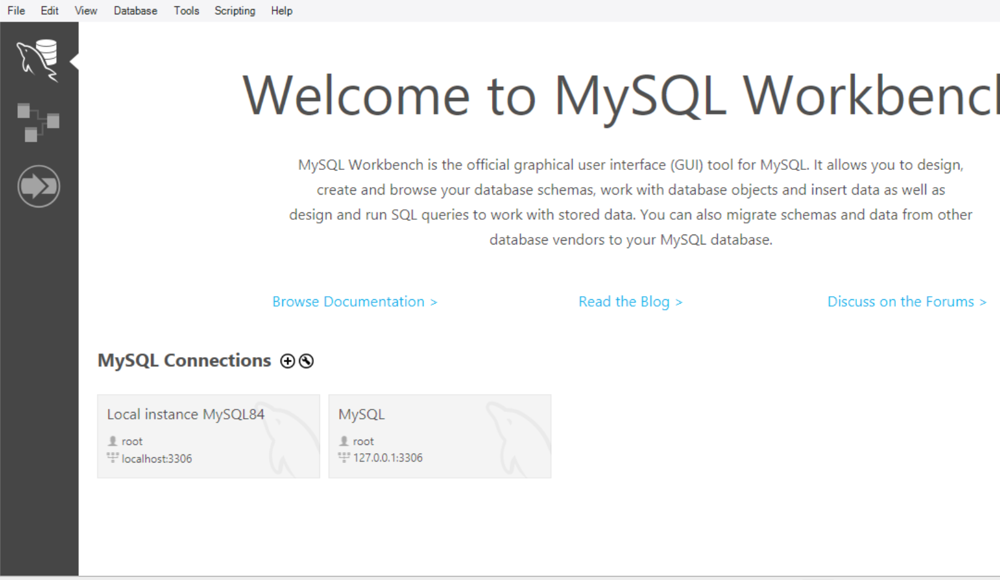
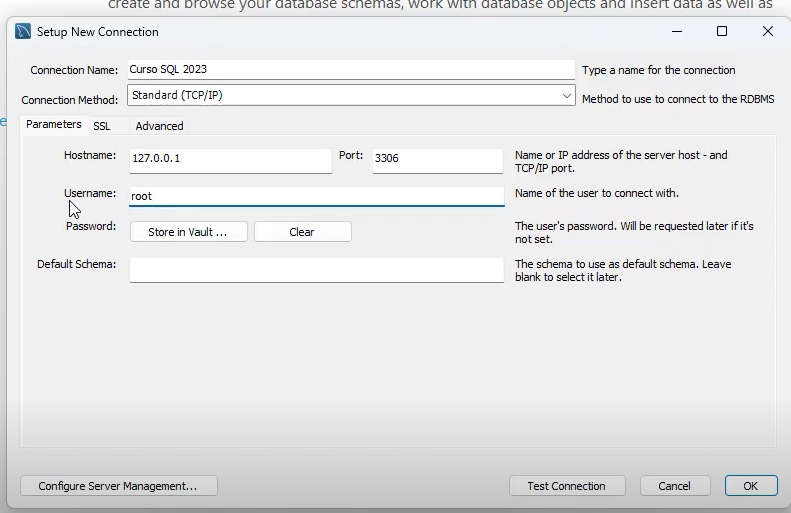
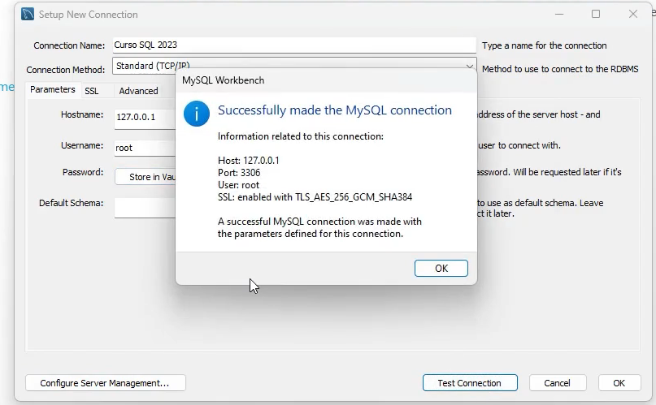
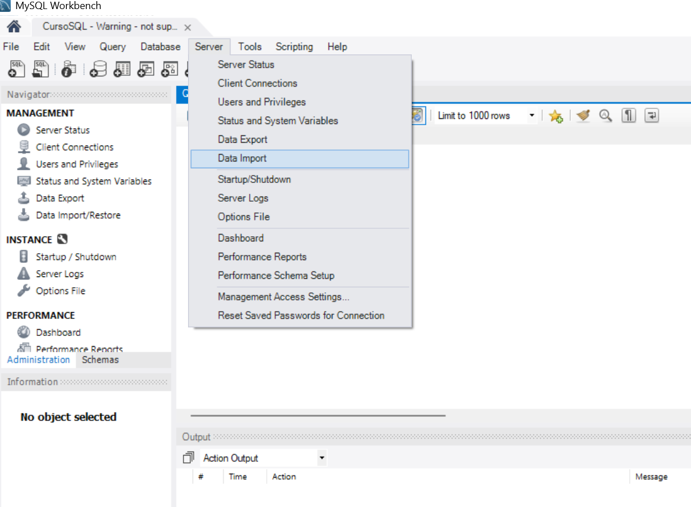
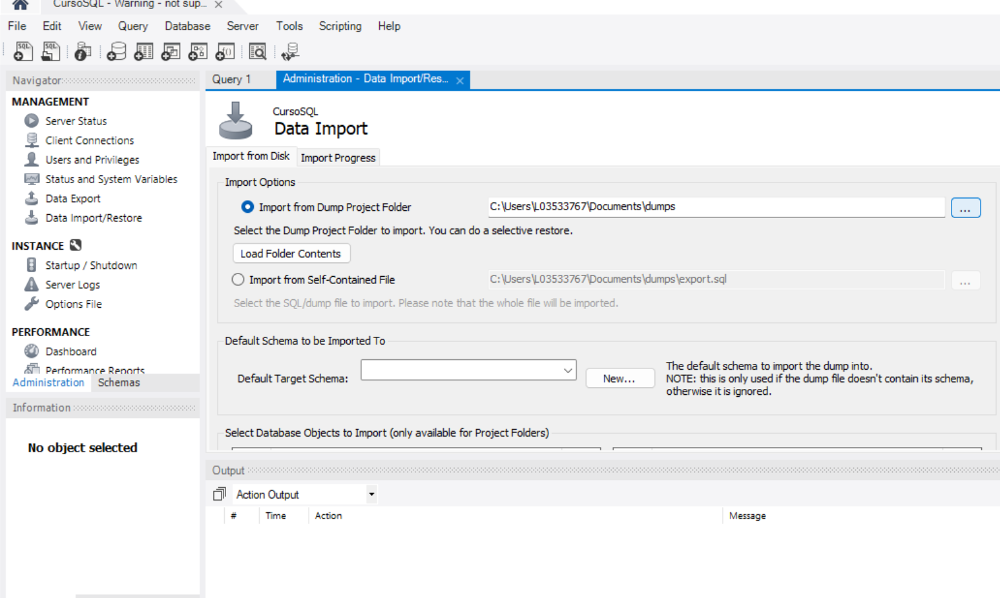
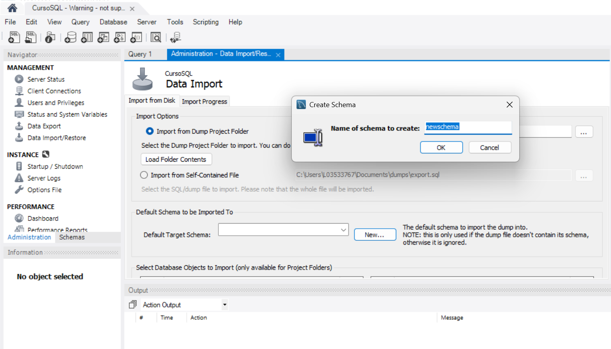
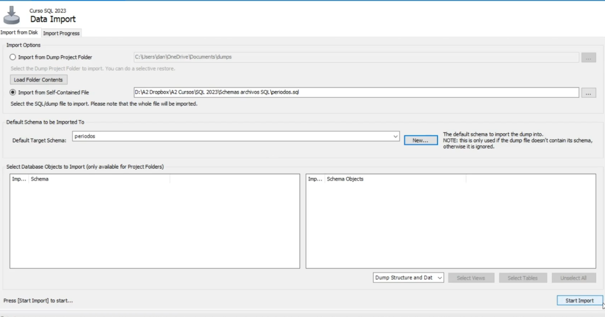

## Comandos de SQL

### SELECT 
Se utiliza pata recuparar datos de una o más tablas en la base de datos.
```
SELECT * FROM usuarios;
```

### Insert
Se utiliza para insertar nuevos registros en una tabla.
```
INSERT INTO usuarios (nombre, edad) VALUES ('Juan', 25);
```

### UPDATE
Se utiliza para actualizar los valores de uno o más registros en una tabla
```
UPDATE usarios SET edad = 26 WHERE nombre='Juan';
```

### DELETE
Se utiliza eliminar uno o más registros de una tabla.
```
DELETE  FROM usuarios WHERE nombre = 'Jose';
```

### CREATE TABLE
Se utiliza para crear una tabla en la base de datos.
```
CREATE TABLE productos (
    id INT  PRIMARY KEY,
    NOMBRE VARCHAR(50),
    precio DECIMAL(10,2)
);
```

### ALTER TABLE
Se utiliza para modificar una tabla existente, como añadir o eliminar columnas.

```
ALTER TABLE productos ADD COLUMN descripcion VARCHAR(100);
```

### DROP TABLE
Se utiliza para eliminar  una tabla de la base de datos.
```
DROP TABLE productos;
```

### JOIN
Se utiliza para combinar filas de dos o más tablas basado en una condición relacionada.
```
SELECT * FROM usuarios JOIN pedidos ON usuarios.id = pedidos.usuarios.usuario_id;
```

### WHERE
Se utiliza para filtrar registros basados en una condición específica.
```
SELECT * FROM usuarios WHERE edad > 18;
```

### GROU BY
Se utiliza para agrupar filas en base a una columna específica.

```
SELECT ciudad, COUNT(*) FROM usuarios GROUP BY ciudad;
```

## Comandos un poco más avnazados.

###  UNION
Se utiliza para combinar el resultado de dos o más consultas en un solo conjunto de resultado.
```
SELECT nombre FROM clientes UNION  SELECT nombre FROM provedores;
```

### SUBCONSULTAS
Se utilizan para incluir una consulta dentro de otra consulta. La subconsulta se ejecuta primero y su resultado se utiliza en la consulta principal.
```
SELECT nombre FROM clientes WHERE id IN (SELECT cliente_id FROM pedidos);
```

### ORDER BY
Se utiliza para ordenar el resultado de una consulta en base a una o más columnas, ya sea en orden ascendente o desentende.
```
SELECT * FROM productos ORDER BY precio DESC;
```

La base de datos vive un servido el cual pude ser local o remoto.

La conexión a una base de datos se compone de:
-   Base de datos (a la que te quieres conectar).
-   El usuario (el usuario que se quiere conectar ala base de datos)
-   La contraseña (La contraseña para poder acceder al base de datos)

## Crear una conexión a mysql desde MySQL Workbench


Precionar en el mas de MySQL Connections


Modificar los campos para conexión tal como

Connection Name: "El nombre de la conexión"
Connection Method: Standard (TCP/IP)
HOST: Es la dirección ip del servidor de la base de datos (127.0.0.1) hace referencia a que la base de datos esta en local.
PORT: 3306 Es pueto por donde te puedes comunicar al servicio de la base de datos.
USERNAME: El usuario que se esta conectando al  base de datos (por defecto root es el super usuario que tiene todos los privilegios sobre la base de datos).
PASSWORD: es la contraseña para acceder al la base de datos.



Para probar la conexión precionado test de Connection.


## Importar informacion de una archivo existente

Ir al menu superior de opciones y seleccionar la opción de Server, despues la opción de Data Import para realizar la importación.


Despues ir a la opcion de Import from Dump Project Folder e importar la base de datos de un archivo.db



Despues crear un nuevo schema de los datos importados.


Uun esquema(o schema en inglés) es básicamente una colección de objetos de base de datos, como tablas, vistas, procedimientos almacenados, índices y otros elementos relacionados. En MySQL la base de datos y el esquemas es practicamente lo mismo.

Por último se realiza la importación en Start Import.


