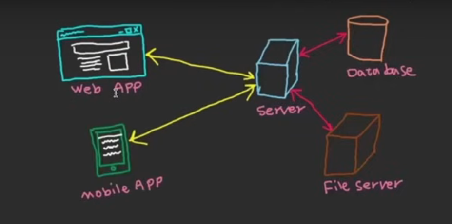

# Frontend y Backend

El frontend y el backend son dos partes fundamentales en el desarrollo de aplicaciones web y de software en general:

### Frontend

Es la parte de la aplicación con la que interactúa directamente el usuario.
Incluye todo lo que ves en la pantalla: botones, menús, formularios, imágenes, estilos, etc.
Se desarrolla principalmente con tecnologías como HTML, CSS y JavaScript (y frameworks como React, Angular, Vue, etc.).
Su objetivo es ofrecer una experiencia visual y funcional al usuario.

### Backend

Es la parte "invisible" para el usuario, encargada de la lógica, procesamiento y gestión de datos.
Se encarga de recibir solicitudes del frontend, procesarlas, acceder a bases de datos, autenticar usuarios, etc.
Se desarrolla con lenguajes como Python (por ejemplo, usando FastAPI, Django), Java, Node.js, Ruby, PHP, entre otros.
Su objetivo es asegurar que la aplicación funcione correctamente y de manera segura.

### Resumen

El frontend es la “cara” de la aplicación, lo que el usuario ve y usa.
El backend es el “cerebro” de la aplicación, donde se procesan los datos y la lógica de negocio.

### La lógica de negocio

La lógica de negocio es el conjunto de reglas, procesos y operaciones que definen cómo funciona una aplicación para cumplir con los objetivos de la empresa o del sistema. Es decir, es el “cerebro” que determina qué se puede y qué no se puede hacer, cómo se procesan los datos y cómo se toman decisiones dentro de la aplicación.

Ejemplos de lógica de negocio:

Calcular el total de una compra aplicando descuentos y sumando impuestos.
Validar que un usuario tenga permisos para realizar cierta acción.
Procesar una solicitud de préstamo y decidir si se aprueba o no según ciertos criterios.
Controlar el flujo de trabajo (por ejemplo, cambiar el estado de un pedido de “pendiente” a “enviado”).
¿Dónde se implementa?

Normalmente, la lógica de negocio se implementa en el backend, en el código que procesa los datos y ejecuta las reglas definidas para la aplicación.

### La base de datos

La base de datos es un sistema que permite almacenar, organizar y gestionar grandes cantidades de información de manera estructurada y eficiente. Es fundamental en la mayoría de las aplicaciones, ya que guarda los datos que la aplicación necesita para funcionar y para ofrecer servicios a los usuarios.

Características principales:

Permite guardar datos de manera persistente (no se pierden cuando se apaga el sistema).
Facilita la búsqueda, actualización, eliminación y consulta de información.
Puede ser relacional (como MySQL, PostgreSQL, SQL Server) o no relacional (como MongoDB, Redis).
Ejemplos de uso en una aplicación:

Guardar información de usuarios (nombre, correo, contraseña).
Almacenar productos de una tienda en línea.
Registrar transacciones, pedidos, mensajes, etc.
Relación con el backend:

El backend es el encargado de comunicarse con la base de datos, enviando y recibiendo información según las necesidades de la lógica de negocio.
El frontend nunca accede directamente a la base de datos; siempre lo hace a través del backend, por motivos de seguridad y control.

### Tipos de base de datos 
Existen varios tipos de bases de datos, cada una diseñada para diferentes necesidades y tipos de datos. Los principales son:

1. Bases de datos relacionales
Organizan la información en tablas con filas y columnas.
Usan SQL (Structured Query Language) para gestionar y consultar los datos.
Ejemplos: MySQL, PostgreSQL, SQL Server, Oracle Database.
Son ideales cuando los datos tienen relaciones claras y estructuradas (por ejemplo, usuarios y pedidos).

2. Bases de datos no relacionales (NoSQL)
No usan tablas tradicionales; pueden almacenar datos como documentos, pares clave-valor, grafos o columnas.
Son más flexibles para datos no estructurados o grandes volúmenes de información.
Tipos comunes:
Documentos: MongoDB, CouchDB.
Clave-valor: Redis, DynamoDB.
Columnas: Cassandra, HBase.
Grafos: Neo4j, ArangoDB.

3. Bases de datos en memoria
Almacenan los datos directamente en la memoria RAM, lo que permite accesos muy rápidos.
Ejemplo: Redis, Memcached.
Se usan para cachés o datos temporales.

4. Bases de datos orientadas a objetos
Guardan información en forma de objetos, similar a la programación orientada a objetos.
Ejemplo: db4o, ObjectDB.

5. Bases de datos distribuidas
Los datos se almacenan en varios servidores o ubicaciones físicas.
Permiten alta disponibilidad y escalabilidad.
Ejemplo: Cassandra, Google Spanner.

### Comunicación de Backend y Frontend

El backend y el frontend se comunican principalmente a través de una red utilizando protocolos y formatos estándar. El método más común es mediante el uso de APIs (Interfaces de Programación de Aplicaciones), especialmente APIs REST o GraphQL. Aquí te explico cómo funciona:

¿Cómo se comunican?
Solicitudes HTTP
El frontend (por ejemplo, una página web o una app móvil) envía solicitudes HTTP (como GET, POST, PUT, DELETE) al backend.
Estas solicitudes se hacen a través de URLs específicas llamadas endpoints.
APIs
El backend expone una API, que es un conjunto de reglas y rutas para que el frontend pueda pedir o enviar información.
Las APIs suelen devolver datos en formato JSON (JavaScript Object Notation), aunque también pueden usar XML u otros formatos.

Respuestas

El backend procesa la solicitud, accede a la base de datos si es necesario, ejecuta la lógica de negocio y responde al frontend con los datos solicitados o el resultado de la operación.
Ejemplo sencillo:

El usuario llena un formulario de registro en el frontend y presiona “Enviar”.
El frontend envía una solicitud POST con los datos del usuario al endpoint /api/usuarios del backend.
El backend recibe los datos, los valida, los guarda en la base de datos y responde con un mensaje de éxito o error.
El frontend muestra el resultado al usuario.
Resumen gráfico: Frontend ⇄ (HTTP/JSON, API REST) ⇄ Backend




### Protocolo HTTP y APIs
Protocolo HTTP

HTTP (HyperText Transfer Protocol) es el protocolo principal que utilizan los navegadores y aplicaciones para comunicarse con los servidores en la web. Es el lenguaje estándar de la web para enviar y recibir información.

Características principales:

Es un protocolo basado en solicitudes y respuestas.
El cliente (por ejemplo, el navegador o el frontend) envía una solicitud HTTP al servidor (backend).
El servidor procesa la solicitud y responde con los datos o el resultado de la operación.

Métodos HTTP más comunes:

GET: Solicita datos al servidor (por ejemplo, obtener información de un usuario).

POST: Envía datos al servidor (por ejemplo, crear un nuevo usuario).

PUT: Actualiza datos existentes en el servidor.

DELETE: Elimina datos en el servidor.

APIs
Una API (Application Programming Interface) es un conjunto de reglas y definiciones que permite que dos aplicaciones se comuniquen entre sí. En el contexto web, una API define cómo el frontend puede interactuar con el backend.

Tipos de APIs web:

REST: Usa HTTP y sigue principios sencillos para crear, leer, actualizar y eliminar recursos. Los datos suelen viajar en formato JSON.

GraphQL: Permite consultar y manipular datos de forma más flexible que REST.

SOAP: Un estándar más antiguo que usa XML para intercambiar información.

¿Cómo se relacionan HTTP y las APIs?

Las APIs web suelen funcionar sobre el protocolo HTTP.
El frontend hace solicitudes HTTP a los endpoints de la 

API del backend.
La API responde con los datos necesarios, normalmente en formato JSON.
Ejemplo de flujo:

El frontend hace una solicitud HTTP GET a la API: GET /api/productos
El backend responde con una lista de productos en formato JSON.

### FastAPI
FastAPI es un framework moderno y rápido para construir APIs web con Python. Está diseñado para facilitar la creación de servicios web robustos, eficientes y fáciles de mantener.

Características principales de FastAPI:

- Rápido y eficiente: Utiliza Starlette y Pydantic internamente, lo que le permite tener un alto rendimiento comparable a frameworks como Node.js y Go.

- Fácil de usar: Permite definir endpoints de manera sencilla usando funciones de Python y anotaciones de tipos.

- Validación automática: Los datos de entrada y salida se validan automáticamente gracias a Pydantic.

- Documentación automática: Genera documentación interactiva (Swagger UI y Redoc) de forma automática para tus APIs.

- Asíncrono: Soporta programación asíncrona con async/await, ideal para aplicaciones que requieren alta concurrencia.

### Instalación de FastAPI

Para instalar FastAPI, puedes usar pip:

```bash
pip install fastapi
```

```bash
pip install fastapi uvicorn
```

### Ejemplo de básico de FastAPI

```python
from fastapi import FastAPI

app = FastAPI()

@app.get("/")
def read_root():
    return {"mensaje": "¡Hola, mundo!"}

@app.get("/usuarios/{usuario_id}")
def leer_usuario(usuario_id: int):
    return {"usuario_id": usuario_id}
```

Para ejecutar una app FastAPI, normalmente se usa Uvicorn:

```bash
uvicorn main:app --reload
```

### ¿Para que se usa FastAPI?
Crear APIs RESTful modernas y seguras.
Backend para aplicaciones web y móviles.
Microservicios.
Proyectos que requieren validación de datos y documentación automática. 

### Los Type Hints

Los type hints en Python son una característica que permite indicar el tipo de datos que se espera que tengan las variables, los parámetros de las funciones y los valores de retorno. Aunque Python es un lenguaje de tipado dinámico (no es obligatorio declarar el tipo de las variables), los type hints ayudan a mejorar la legibilidad del código, facilitan el mantenimiento y permiten a herramientas externas (como editores, linters o analizadores estáticos) detectar errores antes de ejecutar el programa.

-   Ejemplo de uso de type hints

```python
def suma(a: int, b: int) -> int:
    return a + b

nombre: str = "Juan"
edad: int = 30
```

a: int y b: int indican que los parámetros deben ser enteros.

-> int indica que la función debe devolver un entero.
nombre: str y edad: int indican el tipo de las variables.

Importante: Los type hints no obligan a Python a cumplirlos en tiempo de ejecución; son solo una ayuda para el programador y las herramientas de análisis.

### Funciones asincronas

Las funciones asíncronas en Python son funciones que permiten ejecutar tareas que pueden tardar en completarse (como acceder a una base de datos, hacer peticiones a internet, leer archivos, etc.) sin bloquear el resto del programa. Esto es útil para mejorar el rendimiento y la eficiencia, especialmente en aplicaciones que manejan muchas operaciones de entrada/salida (I/O).

¿Cómo se definen?
Se definen usando la palabra clave async antes de la función y pueden usar la palabra await para esperar el resultado de otras funciones asíncronas.

```python
import asyncio

async def saludar():
    print("Hola")
    await asyncio.sleep(1)  # Espera 1 segundo sin bloquear
    print("Mundo")

# Para ejecutar una función asíncrona:
asyncio.run(saludar())
```

Características principales:
Permiten que el programa siga ejecutándose mientras espera que una tarea termine.
Usan las palabras clave async y await.
Son ideales para aplicaciones web, servidores, o cualquier programa que necesite manejar muchas tareas al mismo tiempo.
Ejemplo de uso típico:
En FastAPI, puedes definir endpoints asíncronos para manejar múltiples solicitudes al mismo tiempo de manera eficiente.

```python
from fastapi import FastAPI

app = FastAPI()

@app.get("/")
async def raiz():
    return {"mensaje": "Hola Mundo"}
```

#### Asincronia 
La asincronía es un concepto en programación que permite ejecutar varias tareas al mismo tiempo, sin que una tenga que esperar a que termine la otra para empezar. En vez de realizar las operaciones de manera secuencial (una después de la otra), la asincronía permite que el programa siga funcionando mientras espera que se completen tareas que pueden tardar, como leer archivos, hacer peticiones a internet o acceder a una base de datos.

Por ejemplo, en Python, la asincronía se implementa usando palabras clave como async y await. Esto es muy útil en aplicaciones web (como FastAPI), donde puedes atender a muchos usuarios al mismo tiempo sin que uno tenga que esperar a que terminen las tareas de los demás.

En resumen:

La asincronía mejora la eficiencia y la capacidad de respuesta de los programas.
Permite que el código "espere" tareas largas sin detener el resto del programa.
Es fundamental para aplicaciones que manejan muchas operaciones de entrada/salida (I/O), como servidores web.

Arrancar un servidor FastAPI

Para arrancar un servidor FastAPI, puedes usar el siguiente comando:

```bash
uvicorn main:app --reload
```

Donde:

main es el nombre del archivo que contiene el código de la aplicación.
app es el nombre de la instancia de FastAPI.
--reload activa el reloader, que recarga el servidor automáticamente cuando detecta cambios en el código.

### Swagger

Swagger es una herramienta que permite documentar, visualizar y probar APIs de manera interactiva desde el navegador. Cuando creas una API con frameworks modernos como FastAPI, Swagger genera automáticamente una interfaz web donde puedes ver todos los endpoints disponibles, sus métodos, parámetros y respuestas.

En FastAPI, la documentación Swagger está disponible automáticamente en la ruta /docs cuando ejecutas tu servidor. Esta interfaz facilita:

Probar los endpoints de la API directamente desde el navegador.
Ver la estructura de las solicitudes y respuestas.
Compartir la documentación de la API con otros desarrolladores de forma clara y actualizada.
En resumen:
Swagger convierte tu API en una herramienta fácil de explorar y probar, haciendo más sencillo el desarrollo y la integración con otros sistemas.

Ingresar a swagger

http://localhost:8000/docs

### Redoc 

Redoc es otra herramienta para documentar y visualizar APIs, similar a Swagger, pero con un enfoque en la presentación y la experiencia de usuario. Redoc genera una documentación web elegante, fácil de navegar y muy clara, ideal para compartir con otros desarrolladores o equipos.

En FastAPI, la documentación Redoc también se genera automáticamente y está disponible en la ruta /redoc cuando ejecutas tu servidor. Algunas características de Redoc son:

Interfaz moderna y muy visual.
Navegación sencilla entre los diferentes endpoints y modelos de datos.
Permite ver detalles completos de los parámetros, respuestas y descripciones de la API.
En resumen:
Redoc es una alternativa a Swagger para visualizar la documentación de tu API, ofreciendo una presentación más profesional y amigable.

Ingresar a redoc

http://localhost:8000/redoc

### Operaciones HTTP

Las operaciones HTTP (también conocidas como métodos HTTP) son las acciones básicas que se pueden realizar sobre los recursos de una API o aplicación web. Cada operación tiene un propósito específico y se utiliza para diferentes tipos de interacciones entre el cliente (por ejemplo, tu navegador o una app) y el servidor.

Las operaciones HTTP más comunes son:

GET: Solicita datos de un recurso específico. No modifica nada, solo consulta información.
Ejemplo: Obtener la lista de usuarios.
POST: Envía datos al servidor para crear un nuevo recurso.
Ejemplo: Crear un nuevo usuario.
PUT: Envía datos para actualizar completamente un recurso existente.
Ejemplo: Actualizar toda la información de un usuario.
PATCH: Modifica parcialmente un recurso existente (solo algunos campos).
Ejemplo: Cambiar solo el correo electrónico de un usuario.
DELETE: Elimina un recurso específico.
Ejemplo: Borrar un usuario.
En resumen:

GET: Consultar información.
POST: Crear recursos.
PUT/PATCH: Actualizar recursos.
DELETE: Eliminar recursos.
Estas operaciones forman la base de la comunicación en APIs REST, como las que se crean con FastAPI.

### Endpoints

Un endpoint es una URL específica de una API a la que los clientes pueden enviar solicitudes para acceder a una funcionalidad o recurso determinado. Cada endpoint representa una “puerta de entrada” a una parte concreta de la aplicación, y está asociado a una ruta (por ejemplo, /usuarios, /productos, /login) y a un método HTTP (GET, POST, PUT, DELETE, etc.).

Por ejemplo, en FastAPI:

El endpoint GET /usuarios podría devolver la lista de usuarios.
El endpoint POST /usuarios podría permitir crear un nuevo usuario.
El endpoint GET /productos/5 podría devolver la información del producto con ID 5.
En resumen:

Un endpoint es la combinación de una URL y un método HTTP que permite interactuar con un recurso o funcionalidad de la API.
Cada endpoint define qué datos puedes enviar, recibir y qué acción realiza el servidor.

#### Que es base model de pydantic

BaseModel es una clase base proporcionada por la librería Pydantic, que se utiliza para definir modelos de datos en Python de manera sencilla y robusta. Al heredar de BaseModel, puedes crear clases que validan automáticamente los datos que reciben, asegurándose de que tengan el tipo y formato correcto.

En el contexto de FastAPI, los modelos que heredan de BaseModel se usan para definir la estructura de los datos que tu API espera recibir o devolver (por ejemplo, en solicitudes y respuestas).

Ventajas de usar BaseModel de Pydantic:

Valida automáticamente los tipos de datos (por ejemplo, que un campo sea int, str, etc.).
Permite convertir fácilmente entre diccionarios y objetos.
Facilita la documentación automática de la API.
Permite definir validaciones adicionales y valores por defecto.

```python
from pydantic import BaseModel

class User(BaseModel):
    id: int
    name: str
    age: int
```

En este ejemplo, si intentas crear un User con datos incorrectos (por ejemplo, age="veinte"), Pydantic lanzará un error de validación.

#### Path y Query Parameters

En el contexto de las APIs web (como FastAPI), path y query se refieren a dos formas diferentes de enviar información en una URL:

Path parameters (parámetros de ruta)
Son valores que forman parte de la propia ruta (URL) y se usan para identificar recursos específicos.
Ejemplo de endpoint con parámetro de ruta:

```
GET /users/1
```
Aquí, 5 es un parámetro de ruta (path parameter) que podría representar el ID de un usuario.

En FastAPI:
```python
@app.get("/users/{user_id}")
def get_user(user_id: int):
    return {"user_id": user_id}
```

Query parameters (parámetros de consulta)
Son valores que se envían después del signo de interrogación (?) en la URL, y se usan para filtrar, buscar o modificar la consulta, pero sin formar parte de la ruta principal. Ejemplo:

```
/users?age=30&active=true
```
Aquí, age y active son parámetros de consulta (query parameters).

En FastAPI:
```python
@app.get("/users")
def get_users(age: int, active: bool):
    return {"age": age, "active": active}
```
Resumen:

Path: parte de la ruta, identifica recursos concretos. Ejemplo: /users/5

Query: parte de la consulta, después de ?, filtra o modifica la búsqueda. Ejemplo: /users?age=30

### Query Parameters vs Path Parameters

La decisión de usar query parameters (parámetros de consulta) o path parameters (parámetros de ruta) depende del propósito y el significado de la información que quieres enviar en la URL:

Usa path parameters cuando:
El valor identifica un recurso específico y único.
Es parte fundamental de la “ruta” al recurso.
El endpoint no tiene sentido sin ese valor.
Ejemplos:
/users/5 (el usuario con ID 5)
/products/123 (el producto con ID 123)
/posts/2025/comments (los comentarios del post 2025)
Usa query parameters cuando:
El valor es opcional, sirve para filtrar, buscar, ordenar o modificar el resultado.
Puedes combinar varios filtros o parámetros en la misma ruta.
No cambia la “identidad” del recurso, solo cómo se presenta.
Ejemplos:
/users?age=30&active=true (usuarios filtrados por edad y estado)
/products?category=ropa&sort=price (productos filtrados y ordenados)
/posts?limit=10&offset=20 (paginación)
Resumen:

Path: Identifica recursos únicos y obligatorios (ID, nombre, etc.).
Query: Filtra, busca o modifica la consulta (opcional y combinable).

En Resumen se debe usar
#### PATH: para los parametros que van fijos
#### QUERY: para los parametros que pueden no ser necesarios para hacer la peticion.

