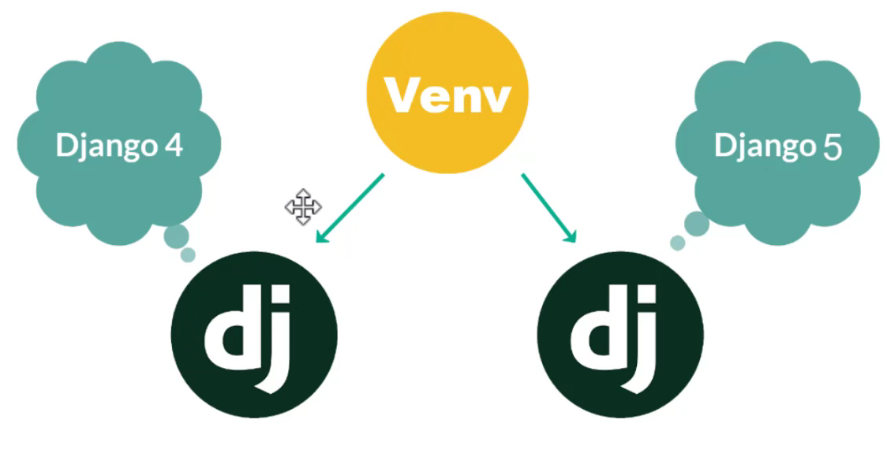

# Python para web

- Python es un lenguaje de programación versátil que se puede usar para desarrollo web.
- Django es un framework web de código abierto que permite crear aplicaciones web rápidas y seguras.

Verificar la version de python:

```bash
python --version
```

verificar la version de pip:

```bash
pip --version
```

## ¿Qué es un espacio virtual?

Un espacio virtual es un entorno aislado que permite crear un entorno de desarrollo independiente de otros proyectos.

Existen algunos espacios virtuales:

- venv
- virtualenv
- conda

Para resolver la situacion de requerir diferentes versiones de python para diferentes proyectos, se puede usar un espacio virtual. o diferentes versiones de un framework. Los entornos vituales, los cuales, en pocas palabras, permiten crear un sistema aislado al sistema operativo y con esto podedemos intalar las dependecias en este entorno virtual:




El que vamos a usar es venv, para poderlo instalar debemos usar el siguiente comando:

```bash
pip install virtualenv
```

Y para crear el entorno virtual:

```bash
python -m venv first-step-d-env
```

Lanzar el entorno virtual:

```bash
first-step-d-env\Scripts\activate
```

Se activa y se puede observar en la terminal que se activo.


Para desactivar el entorno virtual:

```bash
first-step-d-env\Scripts\deactivate
```

Para mostrar las dependencias instaladas:

```bash
pip freeze
```

## Instalar django

```bash
pip install django
```

Para verificar la version de django:

```bash
python -m django --version
```

```bash
django-admin --version
```

## PROYECTO VS APP

Un proyecto en Django conta de una o muchas aplicaciones; es decir para poder hacer algo interesante en nuestro proyecto debemos tener al menos una aplicación.

Un proyecto es una colección de configuraciones para un citio en particular. Un proyecto puede contener múltiples aplicaciones. Una aplplicación ouede estar en múltiples proyectos.

Una aplicación en Django, es una aplicación web que hace algo por ejemplo, un sistema de registro web, una base de daatos, de registros públicos, una API REST, una app de venta de algo, etc.

Y en definitiva el proyecto coniene las aplicaciones y configuraciones a nivel gloval, como la base de datos, aplicaciones instaladas, middleware, templates, etc. Y las aplicaciones son las que realizan las funcionalidades que nosotros implementamos.

El uso de Django para crear aplicacioes, está fuertemente ligado al concepto de modularización, y por ende, podemos crear múltiples aplicaciones pequeñas que realizan tareas en particular, para que en conjunto, podemos tener la aplicación final que nosotros queremos; por ejemplo, para una aplicación tipo blog:

1. Una aplicación para el listado y detalle de los posts.
2. Una aplicación para manejar la autenticación, registro y derivados.
3. Una aplicación para manejar los contactos, asi como manejar los monetarios de post y demas.
4. Una aplicación para manejar una api rest.
5. Una aplicación para manejar información base, como contacto y "acerca de".

Asi que en definitiva la idea es modularizar nuestra aplicación, (usando el concepto de aplicación como el producto final); no tienes que seguir esta estructura al pie de la letra, puedes agregar, quitar o fusionar apliacaciones, pero siempre ten en mente, que mientras más modular mejor será la escalabilidad y el mantenimiento del proyecto.

## Crear un proyecto en Django.

Para crear un proyecto en Django, tenemos el siguiente comando:

```bash
django-admin startproject mystore
```

### Para crear una aplicación

```bash
python manage.py startapp comments
```

### Patrón MTV

Antes de comenzar a desarollar, es importante conocer cómo está construido el framework para entender más facilmente los componentes principales.

Django implementa una variación del patrón conocido como MVC (Modelo, Vista y controlado) de una manera peculiar y con algunas variaciones que ellos llaman MTV, que viene siendo la del Model, Template, View.

Pero tiene una equivalecia prácticamente de uno a uno con el MVC en un cambio más de interceptación que otra cosa; el M, V , C se separa de Django de la siguiente forma:

- M, la M de Modelo que dando igual, que viene siendo la capa de acceso a la base de datos.
- V, la capa que especifica qué los datos vamos a mostrar define la presentación de los datos a usuario, la única diferencia qué es que Django las vistas de nuestro MVC se conocen como Template, porlo tanto pasamos de la V a la T.
- C, la capa del conectar el Modelo con la Vista, esta capa en Django se podria decir que se manejada (o almenos en parte) por el propio framework, ya que es la que se encarga de manejar el ruteo o el manejo de las rutas (interceptar la peticón de nuestro cliente y destinar al "Controlador") la cual especifica que ruta va a llamar a que función en nuestro proyecto en Django URLConf, y por tal motivo tenemos otro tipo de capas que simplemente se llaman "View".

Asi que en resumen:

- M significa "Model" (Modelo), donde sigue siendo la capa que se encarga de comunicar e interactuar con la base de datos.
- T significa "Template" (Plantilla), en este caso la plantilla cumple la función de nuestra vista para el MVC y es la que empleamos para mostrar los datos de nuestro usuario, generalmente la página HTML.
- V significa "View" (Vista), en el patrón de diseño MVT, es la capa encargada de manejar la lógica de negocio, a través de la que se pasarán los datos del modelo a la plantilla; esta capa viene siendo el Controlador del MVC.

### Seleccion del interprete

Para seleccionar el interprete, debemos ir a la carpeta del proyecto y seleccionar el interprete que vamos a usar.

Presionado la combinación de teclas `Ctrl + Shift + P` y escribiendo `Python: Select Interpreter`

Para abrir una nueva ventana de ventana se visual studio code es de la siguiente manera:
`Ctrl + Shift + P`

Para Poder tener selecionado correctamnte el ambiente virtual debemos seleccionar el interprete que se encuentra en la carpeta del proyecto. o Crear un nuevo proyecto presionar `Ctrl + Shift + P` y escribir `Create a new environment` y lo creamos y nombramos. Para activar el ambiente es de la siguiente manera:

```
.\.venv\Scripts\activate
```
